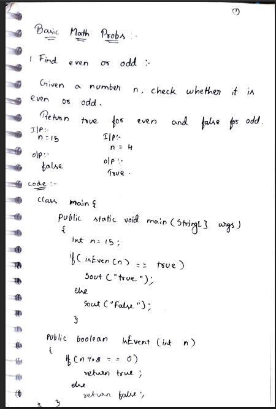
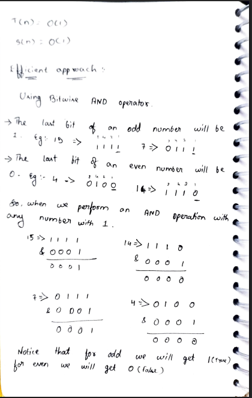
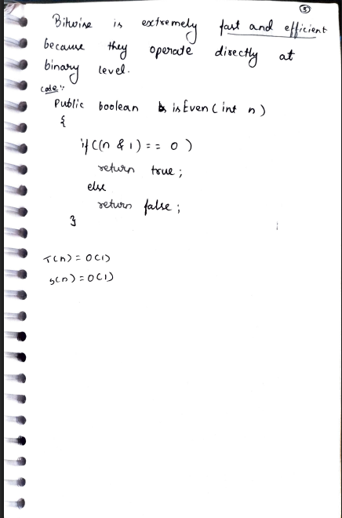

# 1. Find Even or Odd

> **Platform:** [GeeksForGeeks](https://www.geeksforgeeks.org/problems/odd-even/0) | [LeetCode — No direct problem](https://leetcode.com)  
> **Difficulty:** 🟢 Easy  
> **Topic Tags:** `Math` `Bit Manipulation`  
> **Date Solved:** 8-4-2026

---

## 📝 Problem Statement

> Given a number `n`, check whether it is **even** or **odd**.  
> Return `true` for even and `false` for odd.

**Examples:**
```
Input:  n = 15  →  Output: false
Input:  n = 4   →  Output: true
```

---

## 💡 Intuition

> **Modulo Approach:** If `n % 2 == 0`, the number leaves no remainder when divided by 2 → even.  
> Simple and straightforward.
>
> **Bitwise Approach:** In binary, the **last bit** of any odd number is `1`, and any even number is `0`.  
> Performing `n & 1` isolates the last bit — if it's `0`, the number is even; if `1`, it's odd.  
> Bitwise operations are extremely fast because they operate directly at the binary level.

---

## 🔄 Approaches

### ⚡ Approach 1: Modulo Operator
**Idea:** Use `%` (modulo) — if `n % 2 == 0` → even, else → odd.  
**Time:** O(1) | **Space:** O(1)

```java
class Solution {
    public static boolean isEven(int n) {
        if (n % 2 == 0)
            return true;
        else
            return false;
    }
}
```

---

### 🧠 Approach 2: Bitwise AND (Efficient)
**Idea:**
- Last bit of odd number = `1` → `15 → 1111`, `7 → 0111`
- Last bit of even number = `0` → `4 → 0100`, `14 → 1110`
- `n & 1` extracts the last bit
    - Result `0` → even (true)
    - Result `1` → odd (false)

**Time:** O(1) | **Space:** O(1)

```java
class Solution {
    public static boolean isEven(int n) {
        if ((n & 1) == 0)
            return true;
        else
            return false;
    }
}
```

---

## 📊 Complexity Analysis

| Approach       | Time | Space |
|----------------|------|-------|
| Modulo         | O(1) | O(1)  |
| Bitwise AND    | O(1) | O(1)  |

---

## 🗒 Personal Notes

> - Bitwise is preferred in performance-critical code — it's faster than modulo.
> - `n % 2` can return `-1` for negative odd numbers in some languages; `n & 1` always returns `0` or `1`.
> - In Java, `n % 2` returns a negative remainder for negative `n` → use `n % 2 != 0` instead of `== 1` for safety.
> - Pattern: Bit Manipulation — check/set/clear specific bits using `&`, `|`, `^`.

---

## 🖊 Handwritten Notes

  
  


---