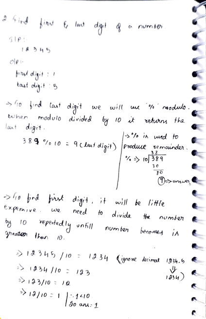
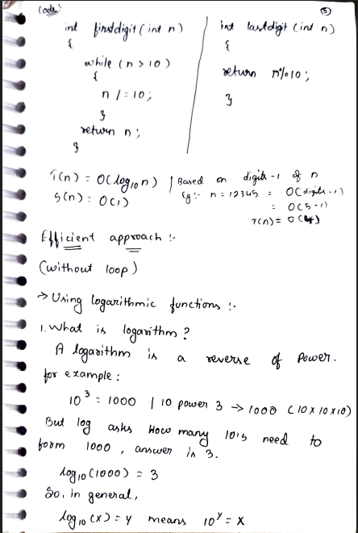
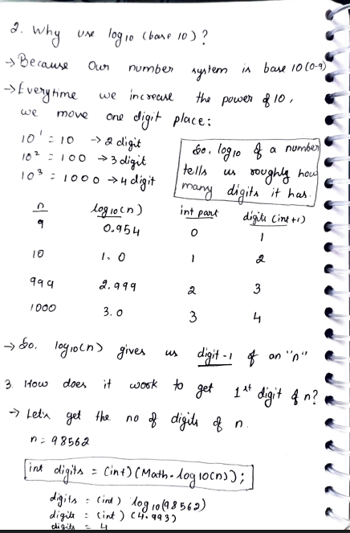
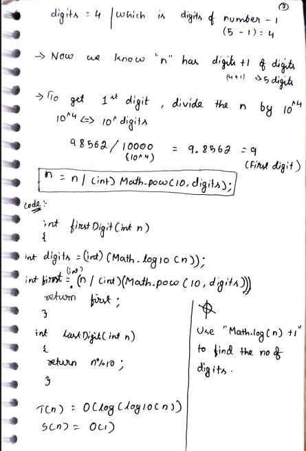

# 2. Find First & Last Digit of a Number

> **Platform:** [GeeksForGeeks](https://www.geeksforgeeks.org/problems/find-first-and-last-digits4435/1)  
> **Difficulty:** 🟢 Easy  
> **Topic Tags:** `Math` `Logarithm`  
> **Date Solved:** 8-4-2026

---

## 📝 Problem Statement

> Given a number `n`, find its **first** (most significant) and **last** (least significant) digits.

**Example:**
```
Input:  n = 12345
Output: First digit = 1, Last digit = 5
```

---

## 💡 Intuition

> **Last Digit:** `n % 10` — modulo by 10 always returns the remainder, which is the last digit.  
> Example: `389 % 10 = 9` ✓
>
> **First Digit (Naive):** Divide `n` by 10 repeatedly until it's less than 10. The leftover is the first digit.  
> Expensive — runs as many times as there are digits.
>
> **First Digit (Efficient — Logarithm):** `log10(n)` gives us (digits - 1) of `n`.  
> So dividing `n` by `10^(digits)` gives us the first digit.  
> Example: `n = 98562` → `log10(98562) = 4.99` → `int = 4` → `98562 / 10000 = 9.8` → `int = 9` ✓

---

## 🔄 Approaches

### ⚡ Approach 1: Modulo (Last Digit) + Loop (First Digit)
**Idea:**
- Last digit: `return n % 10`
- First digit: keep dividing `n /= 10` while `n > 10`

**Time (last):** O(1) | **Time (first):** O(log10 n) | **Space:** O(1)

```java
class Solution {
    public static int lastDigit(int n) {
        return n % 10;
    }

    public static int firstDigit(int n) {
        while (n > 10) {
            n /= 10;
        }
        return n;
    }
}
```

---

### 🧠 Approach 2: Logarithm (Efficient First Digit — No Loop)
**Idea:**
- `log10(n)` → tells roughly how many digits `n` has
- `int digits = (int) Math.log10(n)` → gives `(total_digits - 1)`
- `first = n / (int) Math.pow(10, digits)` → strips away all but the first digit

**Why log10 (base 10)?** Because our number system is base 10 (0–9). Every increase in power of 10 moves one digit place forward.

| n    | log10(n) | int part | digits |
|------|----------|----------|--------|
| 9    | 0.954    | 0        | 1      |
| 10   | 1.0      | 1        | 2      |
| 999  | 2.999    | 2        | 3      |
| 1000 | 3.0      | 3        | 4      |

**Time:** O(log(log10 n)) | **Space:** O(1)

```java
class Solution {
    public static int firstDigit(int n) {
        int digits = (int) Math.log10(n);
        return n / (int) Math.pow(10, digits);
    }
}
```

---

## 📊 Complexity Analysis

| Operation    | Approach           | Time             | Space |
|--------------|--------------------|------------------|-------|
| Last Digit   | Modulo             | O(1)             | O(1)  |
| First Digit  | Naive (Loop)       | O(log10 n)       | O(1)  |
| First Digit  | Logarithm          | O(log(log10 n))  | O(1)  |

---

## 🗒 Personal Notes

> - `n % 10` for last digit is the standard and optimal approach — always O(1).
> - For first digit, prefer the log approach in interviews when efficiency matters.
> - Note: `Use Math.log10(n) + 1` to get total number of digits.
> - `(int) Math.pow(10, digits)` could overflow for very large `n` — use `long` if needed.
> - Pattern: Digit extraction using modulo and division.

---

## 🖊 Handwritten Notes

  
  
  


---