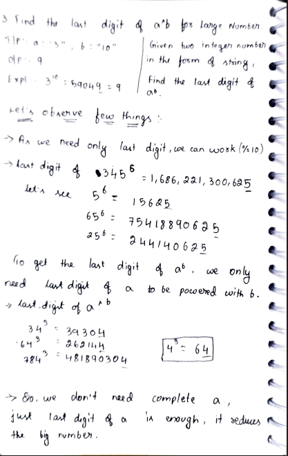
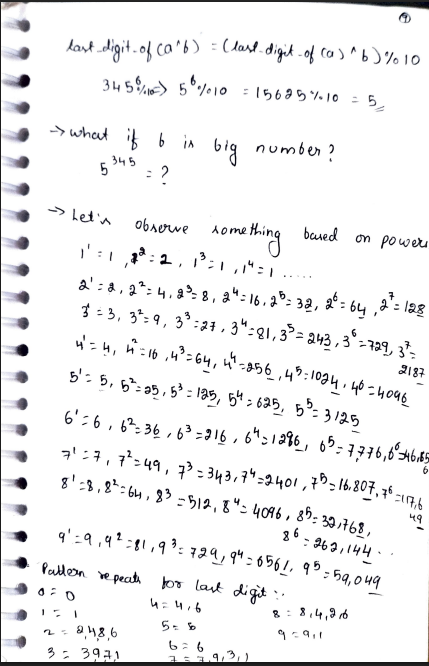
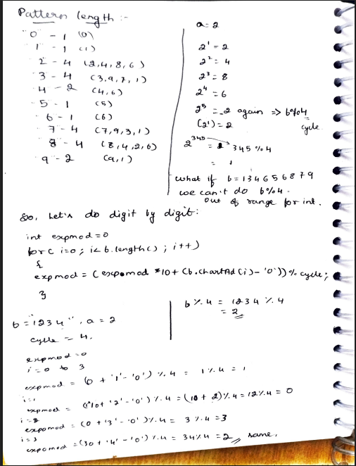
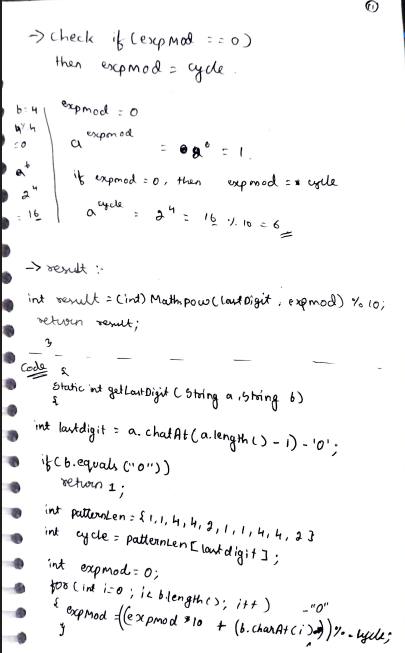
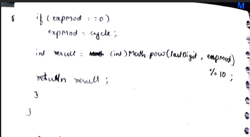

# 3. Find the Last Digit of a^b for Large Numbers

> **Platform:** [GeeksForGeeks](https://www.geeksforgeeks.org/problems/last-digit-of-a-power-b2830/1)  
> **Difficulty:** 🟡 Medium  
> **Topic Tags:** `Math` `Pattern Recognition` `String`  
> **Date Solved:** 8-4-2026

---

## 📝 Problem Statement

> Given two integer numbers in the form of strings `a` and `b`, find the **last digit of a^b**.

**Example:**
```
Input:  a = "3", b = "10"
Output: 9
Explanation: 3^10 = 59049 → last digit = 9
```

---

## 💡 Intuition

> **Key Observation 1:** To get the last digit of `a^b`, we only need the **last digit of `a`** to be raised with `b`.  
> Example: `345^6` → only `5^6 = 15625` matters → last digit = `5`.
>
> **Key Observation 2:** Last digits of powers follow a **repeating cycle pattern**:
> - `2^1=2, 2^2=4, 2^3=8, 2^4=6, 2^5=2` → cycle: `{2,4,8,6}`, length 4
> - `5^1=5, 5^2=25` → always ends in `5`, cycle length 1
>
> So, to find the last digit of `a^b`, find where `b` falls in the cycle of the last digit of `a` (using `b % cycle_length`).
>
> **Key Observation 3:** `b` can be astronomically large (given as string) — so we can't do `b % cycle` directly. Instead, compute `b % cycle` **digit by digit**.

---

## 🔄 Approaches

### 🧠 Approach: Cycle Pattern + Digit-by-Digit Exponent Mod
**Idea:**
1. Extract last digit of `a` → `lastDigit = a % 10`
2. Handle edge case: `b == "0"` → return `1` (anything^0 = 1)
3. Look up cycle length for `lastDigit`:

| Last Digit | Cycle Length | Repeating Pattern |
|------------|--------------|-------------------|
| 0          | 1            | {0}               |
| 1          | 1            | {1}               |
| 2          | 4            | {2, 4, 8, 6}      |
| 3          | 4            | {3, 9, 7, 1}      |
| 4          | 2            | {4, 6}            |
| 5          | 1            | {5}               |
| 6          | 1            | {6}               |
| 7          | 4            | {7, 9, 3, 1}      |
| 8          | 4            | {8, 4, 2, 6}      |
| 9          | 2            | {9, 1}            |

4. Compute `expMod = b % cycle` digit by digit:
    - `expMod = (expMod * 10 + digit) % cycle`
5. If `expMod == 0` → set `expMod = cycle` (use last element of the cycle)
6. Result: `(lastDigit ^ expMod) % 10`

**Time:** O(len(b)) | **Space:** O(1)

```java
class Solution {
    public static int getLastDigit(String a, String b) {
        int lastDigit = a.charAt(a.length() - 1) - '0';

        if (b.equals("0")) return 1;

        int[] patternLen = {1, 1, 4, 4, 2, 1, 1, 4, 4, 2};
        int cycle = patternLen[lastDigit];

        int expMod = 0;
        for (int i = 0; i < b.length(); i++) {
            expMod = (expMod * 10 + (b.charAt(i) - '0')) % cycle;
        }

        if (expMod == 0) expMod = cycle;

        return (int) Math.pow(lastDigit, expMod) % 10;
    }
}
```

---

## 📊 Complexity Analysis

| Approach                  | Time      | Space |
|---------------------------|-----------|-------|
| Cycle + Digit-by-Digit    | O(len(b)) | O(1)  |

---

## 🗒 Personal Notes

> - We can't use `b % cycle` directly when b is a string — it can overflow any integer type.
> - Processing b digit by digit is the trick: `expMod = (expMod * 10 + digit) % cycle`.
> - When `expMod == 0` after the loop, it means b is exactly divisible by cycle → the last element of the cycle applies → set `expMod = cycle`.
> - Example walkthrough: `a=2, b="1234"`, cycle=4.  
    >   `i=0: expMod=(0*10+1)%4=1`  
    >   `i=1: expMod=(1*10+2)%4=0`  
    >   `i=2: expMod=(0*10+3)%4=3`  
    >   `i=3: expMod=(3*10+4)%4=2` → `2^2=4`
> - Pattern: Cycle-based modular arithmetic.

---

## 🖊 Handwritten Notes

  
  
  
  



---