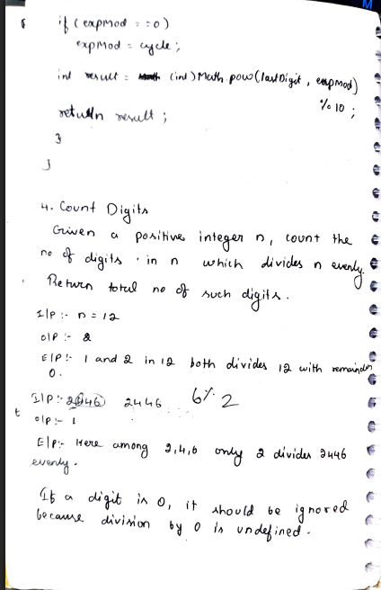
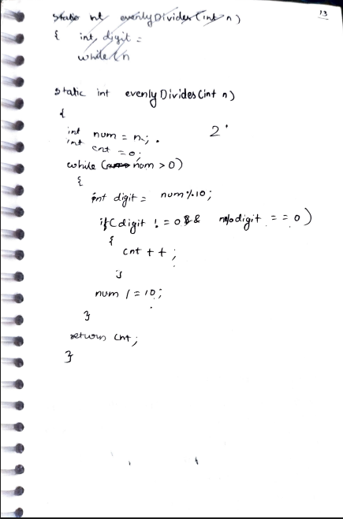

# 4. Count Digits

> **Platform:** [GeeksForGeeks](https://www.geeksforgeeks.org/problems/count-digits5716/1)  
> **Difficulty:** 🟢 Easy  
> **Topic Tags:** `Math` `Digit Manipulation`  
> **Date Solved:** 8-4-2026

---

## 📝 Problem Statement

> Given a positive integer `n`, count the number of **digits in `n`** that **evenly divide `n`** (i.e., `n % digit == 0`).  
> If a digit is `0`, it should be ignored (division by 0 is undefined).

**Examples:**
```
Input:  n = 12   →  Output: 2
Explanation: Digits 1 and 2 both divide 12 with remainder 0.

Input:  n = 2446  →  Output: 1
Explanation: Digits are 2, 4, 4, 6. Only 2 divides 2446 evenly.
```

---

## 💡 Intuition

> Extract each digit of `n` one by one using `% 10` and `/ 10`.  
> For each digit (skip 0), check if `n % digit == 0`.  
> If yes, increment the count.  
> This is a simple digit extraction problem — iterate through all digits once.

---

## 🔄 Approaches

### ⚡ Approach: Digit Extraction with Modulo
**Idea:**
- Extract each digit: `digit = num % 10`
- Guard against `digit == 0` (division by zero)
- Check: `n % digit == 0` → count it
- Move to next digit: `num /= 10`
- Repeat until `num > 0`

**Time:** O(digits of n) | **Space:** O(1)

```java
class Solution {
    static int evenlyDivides(int n) {
        int num = n;
        int cnt = 0;

        while (num > 0) {
            int digit = num % 10;

            if (digit != 0 && n % digit == 0) {
                cnt++;
            }

            num /= 10;
        }

        return cnt;
    }
}
```

---

## 📊 Complexity Analysis

| Approach         | Time             | Space |
|------------------|------------------|-------|
| Digit Extraction | O(digits of n)   | O(1)  |

---

## 🗒 Personal Notes

> - Always handle the `digit == 0` case first to avoid runtime errors.
> - We use the original `n` (not `num`) in `n % digit` because `num` shrinks each iteration.
> - The condition `digit != 0 && n % digit == 0` — the `&&` short-circuits, so if `digit == 0`, the second check is never evaluated.
> - Pattern: Digit extraction — `% 10` to get last digit, `/ 10` to chop it off.

---

## 🖊 Handwritten Notes





---