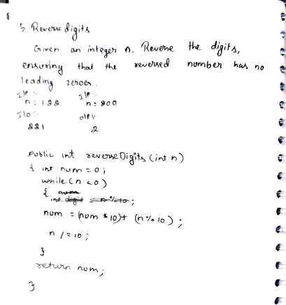

# 5. Reverse Digits

> **Platform:** [GeeksForGeeks](https://www.geeksforgeeks.org/problems/reverse-digit0316/1) | [LeetCode #7 — Reverse Integer](https://leetcode.com/problems/reverse-integer/)  
> **Difficulty:** 🟢 Easy  
> **Topic Tags:** `Math` `Digit Manipulation`  
> **Date Solved:** 8-4-2026

---

## 📝 Problem Statement

> Given an integer `n`, **reverse its digits**, ensuring the reversed number has **no leading zeros**.

**Examples:**
```
Input:  n = 122   →  Output: 221
Input:  n = 800   →  Output: 8    (leading zeros dropped)
Input:  n = 12345 →  Output: 54321
```

---

## 💡 Intuition

> Extract the last digit of `n` using `n % 10`, and build the reversed number by shifting it left each time (`num * 10 + digit`).  
> Remove the processed digit from `n` using `n /= 10`.  
> Leading zeros are automatically handled — when we append a `0` to `num` initially (e.g., for `800`), subsequent digits just build from there.

---

## 🔄 Approaches

### ⚡ Approach: Digit Extraction and Rebuild
**Idea:**
- Initialize `num = 0`
- Each iteration: extract last digit → append to `num` → chop from `n`
- `num = (num * 10) + (n % 10)`
- `n /= 10`
- Repeat until `n == 0`

**Trace for n = 122:**
```
num=0,  n=122  →  digit=2, num=2,  n=12
num=2,  n=12   →  digit=2, num=22, n=1
num=22, n=1    →  digit=1, num=221, n=0
→ return 221
```

**Trace for n = 800:**
```
num=0, n=800 → digit=0, num=0, n=80
num=0, n=80  → digit=0, num=0, n=8
num=0, n=8   → digit=8, num=8, n=0
→ return 8  (no leading zeros!)
```

**Time:** O(log10 n) | **Space:** O(1)

```java
class Solution {
    public static int reverseDigits(int n) {
        int num = 0;

        while (n != 0) {
            num = (num * 10) + (n % 10);
            n /= 10;
        }

        return num;
    }
}
```

---

## 📊 Complexity Analysis

| Approach         | Time          | Space |
|------------------|---------------|-------|
| Digit Extraction | O(log10 n)    | O(1)  |

---

## 🗒 Personal Notes

> - Leading zeros are handled automatically — `num * 10 + 0` just keeps `num` the same, and later non-zero digits shift it correctly.
> - For LeetCode version: need to handle overflow — if `num > Integer.MAX_VALUE / 10`, return `0`.
> - For negative numbers: consider using `Math.abs(n)` and reattaching the sign.
> - This exact logic is also the base of the Palindrome Number check.
> - Pattern: Reverse = extract digit (`% 10`), append (`num*10 + digit`), shrink (`/ 10`).

---

## 🖊 Handwritten Notes



---