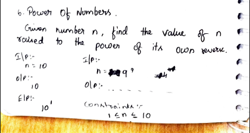
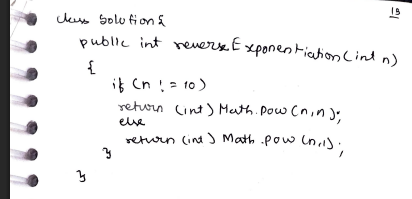

# 6. Power of Numbers

> **Platform:** [GeeksForGeeks](https://www.geeksforgeeks.org/problems/power-of-numbers-1587115620/1)  
> **Difficulty:** 🟢 Easy  
> **Topic Tags:** `Math` `Digit Manipulation`  
> **Date Solved:** 8-4-2026

---

## 📝 Problem Statement

> Given a number `n` (1 ≤ n ≤ 10), find the value of `n` raised to the power of its **own reverse**.

**Examples:**
```
Input:  n = 10  →  Output: 10
Explanation: reverse(10) = 01 = 1 → 10^1 = 10

Input:  n = 9   →  Output: 387420489
Explanation: reverse(9) = 9 → 9^9 = 387420489
```

---

## 💡 Intuition

> For single-digit numbers (1–9), the reverse is the number itself.  
> So `n^reverse(n)` = `n^n`.
>
> For `n = 10`, the reverse of `10` is `01 = 1` (leading zeros dropped).  
> So the result is `10^1 = 10`.
>
> **General Approach:** Compute the reverse of `n` using the standard digit-reversal technique,  
> then return `Math.pow(n, reverse)`.

---

## 🔄 Approaches

### ⚡ Approach 1: Constraint-Based (Optimized for 1 ≤ n ≤ 10)
**Idea:**
- If `n != 10`: it's a single digit → `reverse = n` → return `n^n`
- If `n == 10`: `reverse = 01 = 1` → return `10^1 = 10`

**Time:** O(1) | **Space:** O(1)

```java
class Solution {
    public static int reverseExponentiation(int n) {
        if (n != 10)
            return (int) Math.pow(n, n);
        else
            return (int) Math.pow(n, 1);
    }
}
```

---

### 🧠 Approach 2: General (Compute Reverse, Then Power)
**Idea:**
- Compute reverse of `n` using digit extraction loop
- Return `Math.pow(n, reverse)`
- Works for any `n`, not just 1–10

**Time:** O(log10 n) | **Space:** O(1)

```java
class Solution {
    public static long reverseExponentiationGeneral(int n) {
        int temp = n, rev = 0;
        while (temp > 0) {
            rev = rev * 10 + temp % 10;
            temp /= 10;
        }
        return (long) Math.pow(n, rev);
    }
}
```

---

## 📊 Complexity Analysis

| Approach            | Time       | Space |
|---------------------|------------|-------|
| Constraint-Based    | O(1)       | O(1)  |
| General (Reverse)   | O(log10 n) | O(1)  |

---

## 🗒 Personal Notes

> - The constraint 1 ≤ n ≤ 10 is key to the simplified approach.
> - For the general case, use `long` return type to avoid overflow with large exponents like `9^9`.
> - When reversing `10` → `01` → integer interpretation = `1`.
> - `Math.pow` returns `double` — always cast to `(int)` or `(long)` based on expected range.
> - Pattern: Digit Reversal + Exponentiation.

---

## 🖊 Handwritten Notes

  


---