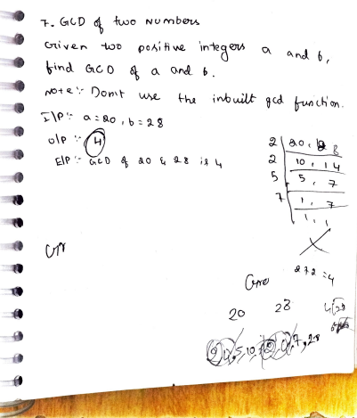
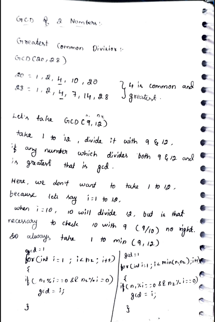
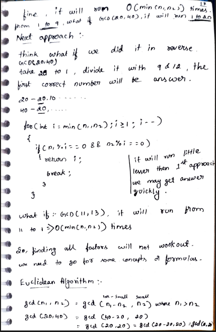
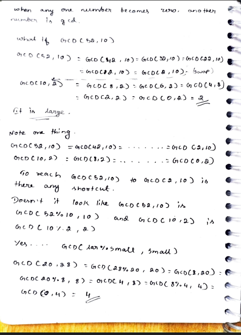
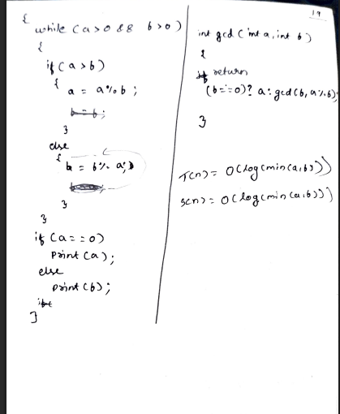

# 7. GCD of Two Numbers

> **Platform:** [GeeksForGeeks](https://www.geeksforgeeks.org/problems/gcd-of-two-numbers3459/1) | [LeetCode #1979 — Find Greatest Common Divisor of Array](https://leetcode.com/problems/find-greatest-common-divisor-of-array/)  
> **Difficulty:** 🟢 Easy  
> **Topic Tags:** `Math` `Euclidean Algorithm`  
> **Date Solved:** 8-4-2026

---

## 📝 Problem Statement

> Given two positive integers `a` and `b`, find their **Greatest Common Divisor (GCD)**.  
> Note: Do **not** use the inbuilt `gcd()` function.

**Example:**
```
Input:  a = 20, b = 28  →  Output: 4
Explanation: Factors of 20 = {1,2,4,10,20}, Factors of 28 = {1,2,4,7,14,28}
             Common: {1,2,4} → Greatest = 4
```

---

## 💡 Intuition

> **Brute Force:** Check every number from 1 to min(a,b) — the last one that divides both is GCD.
>
> **Better:** Start from min(a,b) and go down — the first divisor of both is GCD. Returns early.
>
> **Euclidean Algorithm:** Based on the property:
> `gcd(a, b) = gcd(a % b, b)` where `a > b`  
> Or equivalently: `gcd(a, b) = gcd(b, a % b)`  
> When one number becomes 0, the other is the GCD.  
> This reduces the problem size dramatically (logarithmic steps).
>
> **Why does it work?** `gcd(52, 10)` — instead of checking all numbers 1 to 52,  
> we observe `gcd(52, 10) = gcd(52%10, 10) = gcd(2, 10) = gcd(10%2, 2) = gcd(0, 2) = 2` ✓

---

## 🔄 Approaches

### ⚡ Approach 1: Brute Force (1 to min)
**Idea:** Iterate i from 1 to min(a,b). Keep updating `gcd = i` whenever `i` divides both.  
**Time:** O(min(a,b)) | **Space:** O(1)

```java
class Solution {
    static int gcd(int a, int b) {
        int gcd = 1;
        for (int i = 1; i <= Math.min(a, b); i++) {
            if (a % i == 0 && b % i == 0)
                gcd = i;
        }
        return gcd;
    }
}
```

---

### 🔵 Approach 2: Better (min down to 1)
**Idea:** Iterate from min(a,b) down to 1. Return the first common divisor found.  
**Time:** O(min(a,b)) | **Space:** O(1)

```java
class Solution {
    static int gcd(int a, int b) {
        for (int i = Math.min(a, b); i >= 1; i--) {
            if (a % i == 0 && b % i == 0) return i;
        }
        return 1;
    }
}
```

---

### 🧠 Approach 3: Euclidean Algorithm (Best)
**Idea:**
- `gcd(a, b) = gcd(a % b, b)` when `a > b`
- When one becomes 0, the other is GCD.
- **Iterative version** (O(1) space):

**Time:** O(log(min(a,b))) | **Space:** O(1)

```java
class Solution {
    static int gcd(int a, int b) {
        while (a > 0 && b > 0) {
            if (a > b) a = a % b;
            else       b = b % a;
        }
        return (a == 0) ? b : a;
    }
}
```

- **Recursive version** (compact):

**Time:** O(log(min(a,b))) | **Space:** O(log(min(a,b)))**

```java
class Solution {
    static int gcd(int a, int b) {
        return (b == 0) ? a : gcd(b, a % b);
    }
}
```

---

## 📊 Complexity Analysis

| Approach           | Time              | Space             |
|--------------------|-------------------|-------------------|
| Brute (1 to min)   | O(min(a,b))       | O(1)              |
| Better (min to 1)  | O(min(a,b))       | O(1)              |
| Euclidean          | O(log(min(a,b)))  | O(1)              |
| Euclidean Recursive| O(log(min(a,b)))  | O(log(min(a,b)))  |

---

## 🗒 Personal Notes

> - Euclidean Algorithm is the industry-standard approach — always use this in interviews.
> - The iterative Euclidean is preferred over recursive (avoids stack overhead).
> - Key formula: `gcd(a, b) = gcd(b, a % b)` — the modulo is the shortcut from the subtraction version.
> - Subtraction version: `gcd(a,b) = gcd(a-b, b)` — valid but slow for large differences.
> - GCD relates to LCM: `LCM(a, b) = (a * b) / GCD(a, b)`.
> - Pattern: Euclidean Algorithm — reduce problem using modulo.

---

## 🖊 Handwritten Notes








---