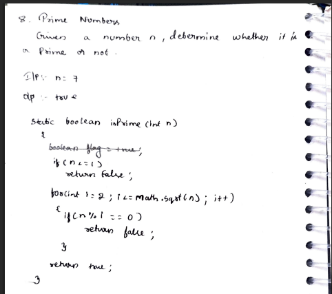

# 8. Prime Numbers

> **Platform:** [GeeksForGeeks](https://www.geeksforgeeks.org/problems/prime-number2314/1) | [LeetCode #204 — Count Primes](https://leetcode.com/problems/count-primes/)  
> **Difficulty:** 🟢 Easy  
> **Topic Tags:** `Math` `Number Theory`  
> **Date Solved:** 8-4-2026

---

## 📝 Problem Statement

> Given a number `n`, determine whether it is a **prime number** or not.  
> Return `true` if prime, `false` otherwise.

**Examples:**
```
Input:  n = 7   →  Output: true   (7 is prime)
Input:  n = 10  →  Output: false  (10 = 2 × 5)
```

---

## 💡 Intuition

> **Brute Force:** Check every number from 2 to n-1 for divisibility. Slow.
>
> **Optimal:** A number `n` can have at most one factor greater than `√n`.  
> If `n = a × b`, and both `a, b > √n`, then `a × b > n` — contradiction.  
> So one of them must be ≤ `√n`.  
> Therefore, checking divisors only up to `√n` is sufficient.  
> If no divisor found in [2, √n] → prime.

---

## 🔄 Approaches

### ⚡ Approach 1: Brute Force (2 to n-1)
**Idea:** Iterate from `i = 2` to `n-1`. If any `i` divides `n`, it's not prime.  
**Time:** O(n) | **Space:** O(1)

```java
class Solution {
    static boolean isPrime(int n) {
        if (n <= 1) return false;
        for (int i = 2; i < n; i++) {
            if (n % i == 0) return false;
        }
        return true;
    }
}
```

---

### 🧠 Approach 2: Optimal — Check up to √n
**Idea:**
- All factor pairs (a, b) where `a × b = n` have at least one element ≤ `√n`
- So checking only up to `Math.sqrt(n)` is enough
- Handle edge case: `n <= 1` → not prime

**Time:** O(√n) | **Space:** O(1)

```java
class Solution {
    static boolean isPrime(int n) {
        if (n <= 1) return false;
        for (int i = 2; i <= Math.sqrt(n); i++) {
            if (n % i == 0) return false;
        }
        return true;
    }
}
```

---

## 📊 Complexity Analysis

| Approach           | Time     | Space |
|--------------------|----------|-------|
| Brute (2 to n-1)   | O(n)     | O(1)  |
| Optimal (√n)       | O(√n)    | O(1)  |

---

## 🗒 Personal Notes

> - Always handle base cases: `n <= 1` → false, `n == 2` → true.
> - `Math.sqrt(n)` in the loop condition is fine — it's computed once per check.
> - For multiple prime checks, use the **Sieve of Eratosthenes** — O(n log log n) preprocessing.
> - `2` is the only even prime. Optimization: check `n == 2` first, then skip even numbers.
> - Pattern: Reduce search space using mathematical bounds (square root property of factors).

---

## 🖊 Handwritten Notes

  

---