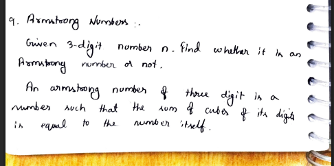
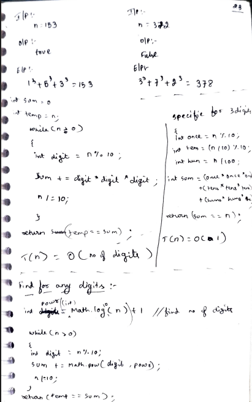

# 9. Armstrong Numbers

> **Platform:** [GeeksForGeeks](https://www.geeksforgeeks.org/problems/armstrong-numbers2727/1)  
> **Difficulty:** 🟢 Easy  
> **Topic Tags:** `Math` `Digit Manipulation`  
> **Date Solved:** 8-4-2026

---

## 📝 Problem Statement

> Given a number `n`, find whether it is an **Armstrong number** or not.  
> An **Armstrong number** of `d` digits is a number such that the **sum of each digit raised to the power `d`** equals the number itself.

**Examples:**
```
Input:  n = 153  →  Output: true
Explanation: 1^3 + 5^3 + 3^3 = 1 + 125 + 27 = 153 ✓

Input:  n = 372  →  Output: false
Explanation: 3^3 + 7^3 + 2^3 = 27 + 343 + 8 = 378 ≠ 372
```

---

## 💡 Intuition

> **3-Digit Specific:** For a 3-digit number, extract the hundreds, tens, and ones digits separately and compute the sum of their cubes.
>
> **General Approach:**
> 1. Find the total number of digits `d` using `Math.log10(n) + 1`.
> 2. Extract each digit using `% 10` and `/ 10`.
> 3. Add `digit^d` to the running sum.
> 4. Compare the final sum with the original `n`.
>
> The power `d` here is the number of digits — not fixed at 3.  
> For example, `9474` is a 4-digit Armstrong: `9^4 + 4^4 + 7^4 + 4^4 = 9474`.

---

## 🔄 Approaches

### ⚡ Approach 1: 3-Digit Specific
**Idea:** Hardcode digit extraction for 3-digit numbers (hundreds, tens, ones).  
**Time:** O(1) | **Space:** O(1)

```java
class Solution {
    static boolean isArmstrong(int n) {
        int ones     = n % 10;
        int tens     = (n / 10) % 10;
        int hundreds = n / 100;

        int sum = ones * ones * ones
                + tens * tens * tens
                + hundreds * hundreds * hundreds;

        return sum == n;
    }
}
```

---

### 🧠 Approach 2: General (Any Number of Digits)
**Idea:**
- `digits = (int) Math.log10(n) + 1` → number of digits
- Loop to extract each digit and add `digit^digits` to sum
- Check `sum == n`

**Time:** O(number of digits) | **Space:** O(1)

```java
class Solution {
    static boolean isArmstrong(int n) {
        int temp = n;
        int digits = (int) Math.log10(n) + 1;
        int sum = 0;

        while (temp > 0) {
            int digit = temp % 10;
            sum += (int) Math.pow(digit, digits);
            temp /= 10;
        }

        return sum == n;
    }
}
```

---

## 📊 Complexity Analysis

| Approach         | Time                 | Space |
|------------------|----------------------|-------|
| 3-Digit Specific | O(1)                 | O(1)  |
| General          | O(number of digits)  | O(1)  |

---

## 🗒 Personal Notes

> - Always use the General approach in interviews — the 3-digit version is too narrow.
> - Known Armstrong numbers: `1, 2, 3, 4, 5, 6, 7, 8, 9, 153, 370, 371, 407, 1634, 8208, 9474`.
> - Use `Math.pow(digit, digits)` — returns `double`, cast to `(int)`.
> - `Math.log10(n) + 1` gives number of digits — valid for `n >= 1`.
> - Pattern: Digit extraction + Power arithmetic.

---

## 🖊 Handwritten Notes

  


---