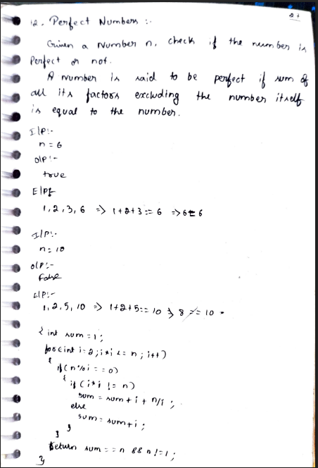
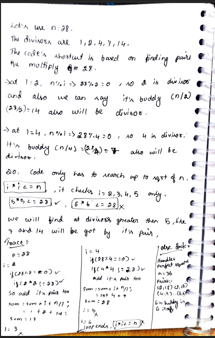

# 12. Perfect Number

> **Platform:** [GeeksForGeeks](https://www.geeksforgeeks.org/perfect-number/) | [LeetCode](https://leetcode.com/problems/perfect-number/)  
> **Difficulty:** 🟢 Easy  
> **Topic Tags:** `Math` `Number Theory`  
> **Date Solved:** 8-4-2026

---

## 📝 Problem Statement

> Given a number `n`, check if it is a **Perfect Number** or not.  
> A number is **perfect** if the sum of all its factors (excluding the number itself) equals the number.

**Examples:**
```
Input:  n = 6    →  Output: true
Explanation: factors of 6 = 1, 2, 3 → 1 + 2 + 3 = 6 ✅

Input:  n = 10   →  Output: false
Explanation: factors of 10 = 1, 2, 5 → 1 + 2 + 5 = 8 ≠ 10 ❌

Input:  n = 28   →  Output: true
Explanation: 1 + 2 + 4 + 7 + 14 = 28 ✅
```

---

## 💡 Intuition

> **Brute Force:** Start `sum = 1` (since 1 always divides n), loop `i` from `2` to `n-1`, add every divisor. Check if `sum == n`.  
> Simple but slow — O(n) iterations.
>
> **Optimised (sqrt trick):** Divisors always come in **pairs** — if `i` divides `n`, then `n/i` also divides `n`.  
> Example: for `n = 28`, at `i = 2` → pair is (2, 14); at `i = 4` → pair is (4, 7).  
> So only loop up to `sqrt(n)` and add both `i` and `n/i` at once.  
> Special case: if `i * i == n` (perfect square), add `i` only once to avoid double counting.

---

## 🔄 Approaches

### ⚡ Approach 1: Brute Force
**Idea:** Iterate from 2 to n-1, collect all divisors, sum them up.  
**Time:** O(n) | **Space:** O(1)

```java
class Solution {
    public static boolean isPerfect(int n) {
        if (n <= 1) return false;

        int sum = 1;

        for (int i = 2; i < n; i++) {
            if (n % i == 0)
                sum += i;
        }

        return sum == n;
    }
}
```

---

### 🧠 Approach 2: Optimised using √n (Better)
**Idea:**
- Start `sum = 1` (1 is always a divisor, exclude n itself)
- Loop `i` from `2` while `i * i <= n`:
    - If `n % i == 0`:
        - If `i * i != n`: add both `i` and `n/i` (divisor pair)
        - If `i * i == n`: add only `i` (perfect square, avoid double count)
- Check if `sum == n`

**Trace for n = 28:**
```
sum = 1
i=2: 28%2=0, pair=(2,14) → sum = 1+2+14 = 17
i=3: 28%3≠0, skip
i=4: 28%4=0, pair=(4,7) → sum = 17+4+7 = 28
i=5: 5*5=25 ≤ 28, 28%5≠0
i=6: 6*6=36 > 28, loop ends
sum == n → true ✅
```

**Time:** O(√n) | **Space:** O(1)

```java
class Solution {
    public static boolean isPerfectOptimised(int n) {
        if (n <= 1) return false;

        int sum = 1;

        for (int i = 2; i * i <= n; i++) {
            if (n % i == 0) {
                if (i * i != n)
                    sum += i + n / i;
                else
                    sum += i;
            }
        }

        return sum == n && n != 1;
    }
}
```

---

## 📊 Complexity Analysis

| Approach | Time | Space |
|----------|------|-------|
| Brute Force | O(n) | O(1) |
| Optimised (sqrt) | O(√n) | O(1) |

---

## 🗒 Personal Notes

> - **Optimised approach** is preferred in interviews — O(√n) is much faster
> - The `else` block (handling `i * i == n`) is crucial — without it, perfect squares like `n = 36` would count `6` twice
> - Well-known perfect numbers: **6, 28, 496, 8128** — very rare!
> - Always exclude `n` itself from the sum (that's why we start `sum = 1` and loop till `n-1` or `sqrt(n)`)
> - Pattern: Divisor pairs — iterate only to √n

---

## 🖊 Handwritten Notes

  
