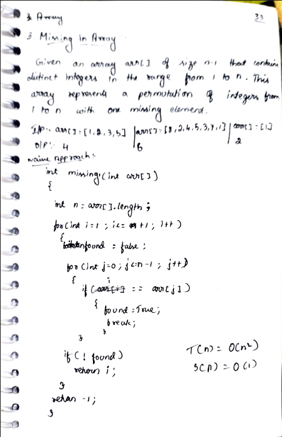
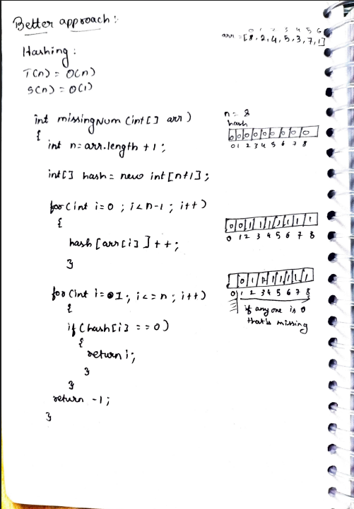
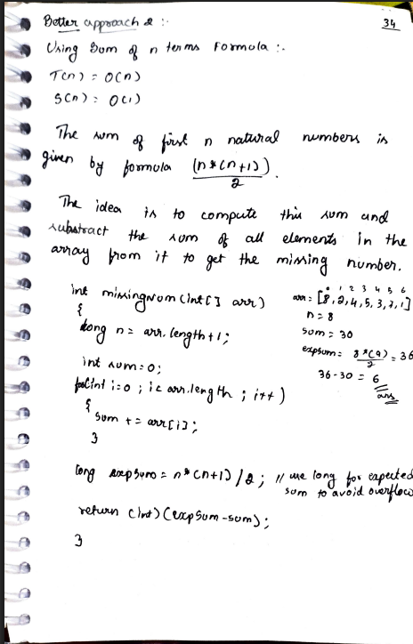

# 3. Missing Number in Array

> **Platform:** [LeetCode 268](https://leetcode.com/problems/missing-number/description/) | [GeeksForGeeks](https://www.geeksforgeeks.org/problems/missing-number-in-array1416/1) |  
> **Difficulty:** 🟢 Easy  
> **Topic Tags:** `Array` `Math` `Hashing`  
> **Date Solved:** 7-4-2026

---

## 📝 Problem Statement

> Given an array `arr[]` of size `n-1` that contains distinct integers in the range `1` to `n`.
> This array represents a permutation of integers from `1` to `n` with one element missing.
> Find the **missing element**.

**Example:**
```
Input:  arr[] = [1, 2, 3, 5]
Output: 4

Input:  arr[] = [8, 2, 4, 5, 3, 7, 1]
Output: 6

Input:  arr[] = [1]
Output: 2
```

---

## 💡 Intuition

> **Naive:** For each number from 1 to n, search if it exists in the array.  
>
> **Hashing:** Create a frequency array. Mark all present elements. Scan and return the first one with count 0.  
>
> **Sum Formula (Best):**  
> We know sum of 1 to n = `n*(n+1)/2`.  
> Compute actual sum of array.  
> `Missing = expectedSum - actualSum`.  
> Use `long` for expected sum to avoid overflow.

---

## 🔄 Approaches

### 🐌 Brute Force – Naive
**Idea:** For each number 1 to n, linear search if it's in the array.  
**Time:** O(n²) | **Space:** O(1)

```java
class Solution {
    public int missing(int[] arr) {
        int n = arr.length;
        for (int i = 1; i <= n + 1; i++) {
            boolean found = false;
            for (int j = 0; j < n; j++) {
                if (i == arr[j]) { found = true; break; }
            }
            if (!found) return i;
        }
        return -1;
    }
}
```

---

### 🧠 Better – Hashing
**Idea:**
- Create `hash[]` of size `n+1`
- Increment `hash[arr[i]]` for each element
- Scan from `i = 1` to `n`, return first `i` where `hash[i] == 0`

**Time:** O(n) | **Space:** O(n)

```java
class Solution {
    public int missingNum(int[] arr) {
        int n = arr.length + 1;
        int[] hash = new int[n + 1];

        for (int i = 0; i < arr.length; i++) {
            hash[arr[i]]++;
        }

        for (int i = 1; i <= n; i++) {
            if (hash[i] == 0) return i;
        }

        return -1;
    }
}
```

---

### ⚡ Better 2 – Sum Formula (Optimal)
**Idea:**
- `n = arr.length + 1` (complete range 1 to n)
- `expSum = n * (n+1) / 2`
- Sum up all elements in array
- `missing = expSum - sum`

**Time:** O(n) | **Space:** O(1)

```java
class Solution {
    public int missingNum(int[] arr) {
        long n = arr.length + 1;
        int sum = 0;

        for (int i = 0; i < arr.length; i++) {
            sum += arr[i];
        }

        long expSum = n * (n + 1) / 2;
        return (int)(expSum - sum);
    }
}
```

---

## 📊 Complexity Analysis

| Approach | Time | Space |
|----------|------|-------|
| Brute (Naive) | O(n²) | O(1) |
| Better (Hashing) | O(n) | O(n) |
| Optimal (Sum Formula) | O(n) | O(1) |

---

## 🗒 Personal Notes

> - 🔥 Best approach = Sum Formula (O(n) time, O(1) space)
> - **Use `long` for `expSum`** — `n*(n+1)/2` can overflow `int` for large n
> - Hashing approach: `n = arr.length + 1` because array has n-1 elements
> - LC 268 gives array from 0 to n range (slightly different); GFG is 1 to n
> - Pattern: Sum formula for "find missing in range"

---

## 🖊 Handwritten Notes





---
