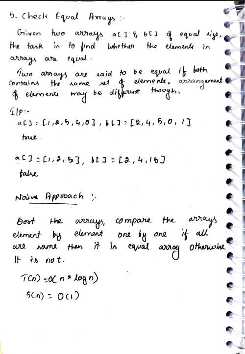
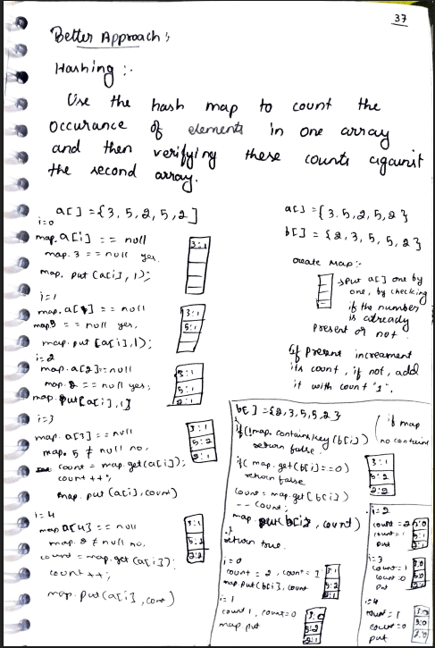
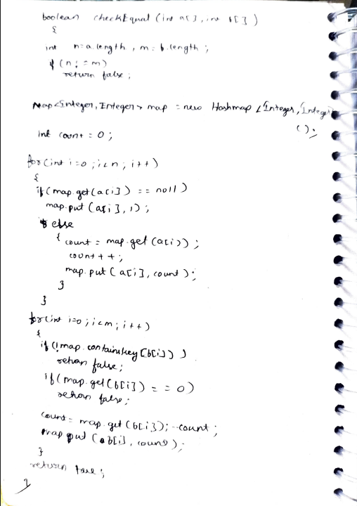

# 5. Check Equal Arrays

> **Platform:** [GeeksForGeeks](https://www.geeksforgeeks.org/problems/check-if-two-arrays-are-equal-or-not3847/1) |  
> **LeetCode:** No direct equivalent |  
> **Difficulty:** 🟢 Easy  
> **Topic Tags:** `Array` `Hashing` `Sorting`  
> **Date Solved:** 7-4-2026

---

## 📝 Problem Statement

> Given two arrays `a[]` and `b[]` of equal size, determine whether they have the **same set of elements** (arrangement may be different).
> Two arrays are equal if both contain the same multiset of elements.

**Example:**
```
Input:  a[] = [1, 2, 5, 4, 0],  b[] = [2, 4, 5, 0, 1]
Output: true

Input:  a[] = [1, 2, 5],  b[] = [2, 4, 15]
Output: false
```

---

## 💡 Intuition

> **Naive:** Sort both arrays and compare element by element.
>
> **HashMap (Better):**  
> Count frequencies of all elements in `a[]` using a HashMap.  
> Then for each element in `b[]`, check it exists in the map with count > 0, and decrement.  
> This correctly handles **duplicates** (unlike HashSet).
>
> **Why HashSet fails:**  
> For `a = [7, 2, 2]` and `b = [1, 7]`, HashSet would wrongly return `true`  
> because it doesn't track how many times an element appeared.  
> HashMap with frequency counts solves this.

---

## 🔄 Approaches

### 🐌 Naive – Sort & Compare
**Idea:** Sort both arrays, compare element by element.  
**Time:** O(n log n) | **Space:** O(1)

```java
class Solution {
    public boolean checkEqual(int[] a, int[] b) {
        if (a.length != b.length) return false;

        Arrays.sort(a);
        Arrays.sort(b);

        for (int i = 0; i < a.length; i++) {
            if (a[i] != b[i]) return false;
        }

        return true;
    }
}
```

---

### ⚡ Better – HashMap with Frequencies
**Algorithm:**
1. If lengths differ → return `false`
2. Build frequency map from `a[]`
3. For each element in `b[]`:
   - If not in map → return `false`
   - If count is 0 → return `false`
   - Else decrement count
4. Return `true`

**Time:** O(n) | **Space:** O(n)

```java
class Solution {
    public boolean checkEqual(int[] a, int[] b) {
        int n = a.length, m = b.length;
        if (n != m) return false;

        Map<Integer, Integer> map = new HashMap<>();

        for (int i = 0; i < n; i++) {
            if (map.get(a[i]) == null) {
                map.put(a[i], 1);
            } else {
                int count = map.get(a[i]);
                map.put(a[i], count + 1);
            }
        }

        for (int i = 0; i < m; i++) {
            if (!map.containsKey(b[i])) return false;
            if (map.get(b[i]) == 0)     return false;

            map.put(b[i], map.get(b[i]) - 1);
        }

        return true;
    }
}
```

---

## 📊 Complexity Analysis

| Approach | Time | Space |
|----------|------|-------|
| Naive (Sort) | O(n log n) | O(1) |
| Better (HashMap) | O(n) | O(n) |

---

## 🗒 Personal Notes

> - 🔥 Best approach = HashMap with frequencies
> - **HashSet is wrong here** — it doesn't handle duplicates (e.g., `a=[7,2,2]`, `b=[1,7]` → HashSet says true)
> - HashMap tracks count → handles multisets correctly
> - `map.getOrDefault(num, 0) + 1` is cleaner Java shorthand for the frequency increment
> - Pattern: Frequency counting with HashMap for multiset equality

---

## 🖊 Handwritten Notes





---
