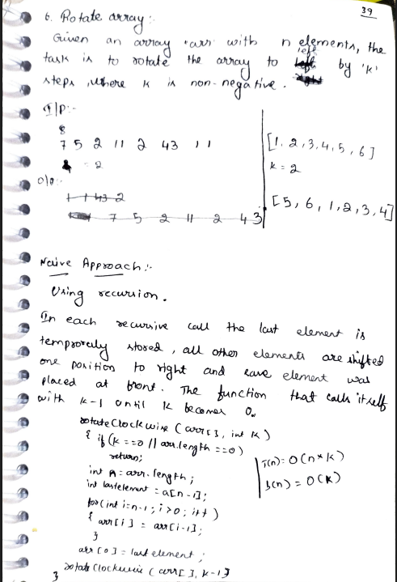
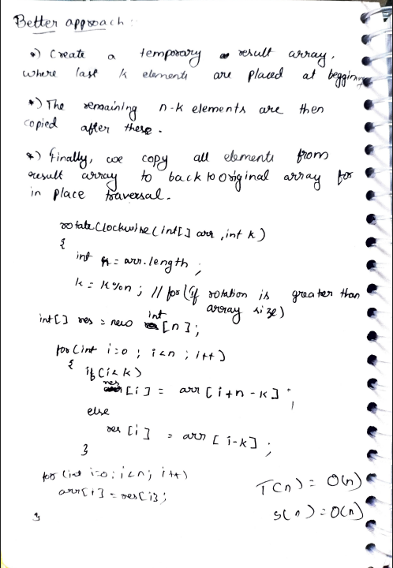
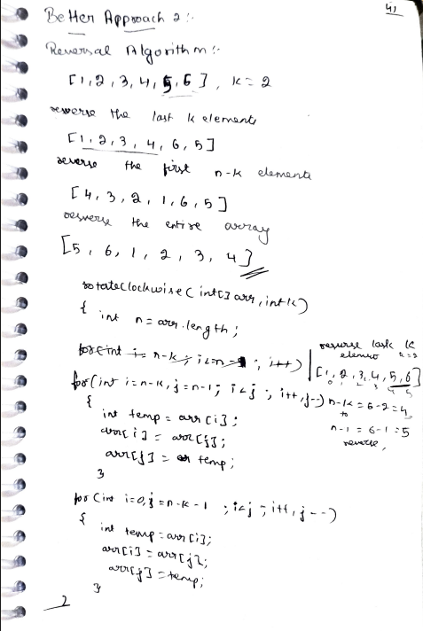

# 6. Rotate Array (Left Rotation by K Steps)

> **Platform:** [GeeksForGeeks](https://www.geeksforgeeks.org/problems/rotate-array-by-n-elements-1587115621/1) |  
> **LeetCode:** [LC 189](https://leetcode.com/problems/rotate-array/) *(Right rotation variant)* |  
> **Difficulty:** 🟢 Easy  
> **Topic Tags:** `Array` `Two Pointers`  
> **Date Solved:** 7-4-2026

---

## 📝 Problem Statement

> Given an array `arr[]` with `n` elements, rotate the array to the **left** by `k` steps.

**Example:**
```
Input:  arr[] = [7, 5, 2, 11, 2, 43, 11], k = 2
Output: [2, 11, 2, 43, 11, 7, 5]

Input:  arr[] = [1, 2, 3, 4, 5, 6], k = 2
Output: [3, 4, 5, 6, 1, 2]
```

---

## 💡 Intuition

> **Left rotate by k** means:  
> - First `k` elements move to the end  
> - Last `n-k` elements move to the front  
>
> **Reversal Algorithm (Optimal):**  
> For left rotation by `k`:
> 1. Reverse the **last k elements**
> 2. Reverse the **first n-k elements**
> 3. Reverse the **entire array**
>
> This is the in-place O(n) solution with O(1) space.

---

## 🔄 Approaches

### 🐌 Naive – Recursion (One Step at a Time)
**Idea:** Each call shifts all elements one right, places last at front. Repeat k times.  
**Time:** O(n × k) | **Space:** O(k) — recursion stack

```java
class Solution {
    public void rotateClockwise(int[] arr, int k) {
        if (k == 0 || arr.length == 0) return;

        int n = arr.length;
        int last = arr[n - 1];

        for (int i = n - 1; i > 0; i--) arr[i] = arr[i - 1];
        arr[0] = last;

        rotateClockwise(arr, k - 1);
    }
}
```

---

### 🧠 Better – Temp Array
**Idea:**
- Create result array
- If `i < k`: `res[i] = arr[i + n - k]` (last k elements come first)
- Else: `res[i] = arr[i - k]` (then first n-k elements)
- Copy result back

**Time:** O(n) | **Space:** O(n)

```java
class Solution {
    public void rotateLeft(int[] arr, int k) {
        int n = arr.length;
        k = k % n;
        int[] res = new int[n];

        for (int i = 0; i < n; i++) {
            if (i < k) res[i] = arr[i + n - k];
            else       res[i] = arr[i - k];
        }

        for (int i = 0; i < n; i++) arr[i] = res[i];
    }
}
```

---

### ⚡ Optimal – Reversal Algorithm
**Steps for Left Rotate by k:**
1. Reverse last `k` elements: `reverse(arr, n-k, n-1)`
2. Reverse first `n-k` elements: `reverse(arr, 0, n-k-1)`
3. Reverse entire array: `reverse(arr, 0, n-1)`

**Walkthrough `[1,2,3,4,5,6]`, k=2:**
```
Step 1 (reverse last 2):    [1, 2, 3, 4, 6, 5]
Step 2 (reverse first 4):   [4, 3, 2, 1, 6, 5]
Step 3 (reverse all):       [5, 6, 1, 2, 3, 4] ✅
```

**Time:** O(n) | **Space:** O(1)

```java
class Solution {
    public void rotateLeft(int[] arr, int k) {
        int n = arr.length;
        k = k % n;

        reverse(arr, n - k, n - 1);      // Reverse last k
        reverse(arr, 0, n - k - 1);      // Reverse first n-k
        reverse(arr, 0, n - 1);          // Reverse entire array
    }

    private void reverse(int[] arr, int left, int right) {
        while (left < right) {
            int temp = arr[left];
            arr[left] = arr[right];
            arr[right] = temp;
            left++;
            right--;
        }
    }
}
```

---

## 📊 Complexity Analysis

| Approach | Time | Space |
|----------|------|-------|
| Naive (Recursion) | O(n × k) | O(k) |
| Better (Temp Array) | O(n) | O(n) |
| Optimal (Reversal) | O(n) | O(1) |

---

## 🗒 Personal Notes

> - 🔥 Best approach = Reversal Algorithm
> - **Left rotation ≠ Right rotation** — reversal steps differ:
>   - Left by k: reverse(last k) → reverse(first n-k) → reverse(all)
>   - Right by k: reverse(all) → reverse(first k) → reverse(last n-k)
> - Always do `k = k % n` first (handles k > n)
> - Pattern: Reversal algorithm for array rotation

---

## 🖊 Handwritten Notes





---
