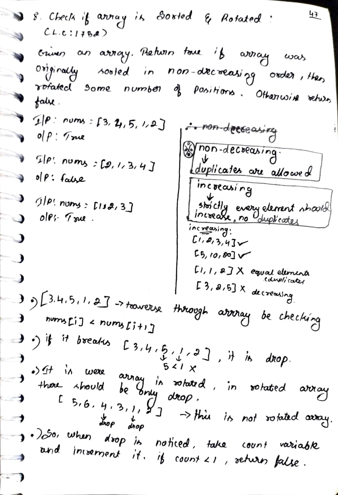
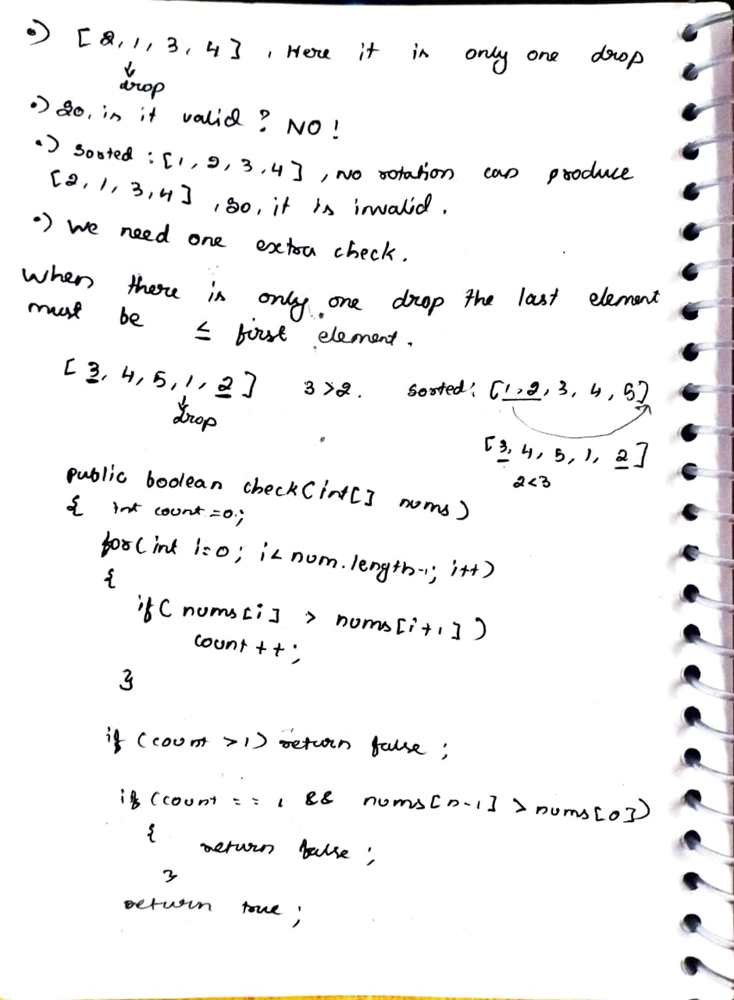

# [8]. Check if Array is Sorted and Rotated

> **Platform:** [LeetCode](https://leetcode.com/problems/check-if-array-is-sorted-and-rotated/description/) |  
> **Difficulty:** 🟢 a1_easy  
> **Topic Tags:** `Array`  
> **Date Solved:** 20-01-2026

---

## 📝 Problem Statement

> Given an array nums, return true if the array was originally sorted in non-decreasing order, then rotated some number of positions. Otherwise, return false.

👉 Note:

 - Non-decreasing means duplicates are allowed  
 - Rotation means shifting elements circularly

**Example:**
```
Input:  [3, 4, 5, 1, 2]
Output:  true
Explanation:  Sorted array [1,2,3,4,5] rotated

Input:  [2, 1, 3, 4]  
Output: false  

Input:  [1, 2, 3]  
Output: true  
```

---

## 💡 Intuition

> In a sorted + rotated array, there will be at most one "drop" point where nums[i] > nums[i+1].  
If more than one drop exists → not a valid rotated sorted array.  
If exactly one drop exists, ensure last element ≤ first element.

---

## 🔄 Approaches

### 🐌 Brute Force
**Idea:** Try all possible rotations and check if any becomes sorted.  
**Time:** O(n²) | **Space:** O(1)

```cpp
// Brute force code here
class a1_easy.p08.SortedArray2.a1_easy.p09.RemoveDuplicatesSortedArray.a1_easy.p10.RotateArrayByK.a1_easy.p01.LargestElement.a1_easy.p02.SecondLargestElement.Solution {

    // Function to check if array is sorted (non-decreasing)
    private boolean isSorted(int[] arr) {
        for (int i = 0; i < arr.length - 1; i++) {
            if (arr[i] > arr[i + 1]) {
                return false;
            }
        }
        return true;
    }

    // Function to rotate array by 1 step to right
    private void rotate(int[] arr) {
        int n = arr.length;
        int last = arr[n - 1];

        for (int i = n - 1; i > 0; i--) {
            arr[i] = arr[i - 1];
        }

        arr[0] = last;
    }

    public boolean check(int[] nums) {
        int n = nums.length;

        // Try all rotations
        for (int i = 0; i < n; i++) {

            if (isSorted(nums)) {
                return true;
            }

            rotate(nums); // rotate and try again
        }

        return false;
    }

    public static void main(String[] args) {
        a1_easy.p08.SortedArray2.a1_easy.p09.RemoveDuplicatesSortedArray.a1_easy.p10.RotateArrayByK.a1_easy.p01.LargestElement.a1_easy.p02.SecondLargestElement.Solution obj = new a1_easy.p08.SortedArray2.a1_easy.p09.RemoveDuplicatesSortedArray.a1_easy.p10.RotateArrayByK.a1_easy.p01.LargestElement.a1_easy.p02.SecondLargestElement.Solution();

        int[] arr1 = {3, 4, 5, 1, 2};
        System.out.println(obj.check(arr1)); // true

        int[] arr2 = {2, 1, 3, 4};
        System.out.println(obj.check(arr2)); // false
    }
}
```

---

### ⚡ Optimal
**Idea:** Count the number of "drops" (nums[i] > nums[i+1]) in one pass.
 - If drops > 1 → false
 - If drops == 1 → check nums[n-1] <= nums[0]
 - Else → true   
**Time:** O(n) | **Space:** O(1)

```cpp
// Optimal code here
class a1_easy.p08.SortedArray2.a1_easy.p09.RemoveDuplicatesSortedArray.a1_easy.p10.RotateArrayByK.a1_easy.p01.LargestElement.a1_easy.p02.SecondLargestElement.Solution {
    public boolean isSorted(int[] nums) {
        int n = nums.length;
        int count = 0;

        for(int i = 0; i < n - 1; i++) {
            if(nums[i] > nums[i + 1]) {
                count++;
            }
        }

        if(count > 1) return false;

        if(count == 1 && nums[n - 1] > nums[0]) {
            return false;
        }

        return true;
    }
}
```

---

## 📊 Complexity Analysis

| Approach | Time | Space |
|----------|------|-------|
| Brute | O(n²) | O(1) |
| Optimal | O(n) | O(1) |

---

## 🗒 Personal Notes

> - Key trick: Count drops (break in sorted order)
> - Only one drop allowed in rotated sorted array
> - Important edge case: last element must be ≤ first when 1 drop exists
> - Handles duplicates (non-decreasing order)

---

## 🖊 Handwritten Notes

<!-- Add your handwritten notes image here -->
<!--  -->




---
