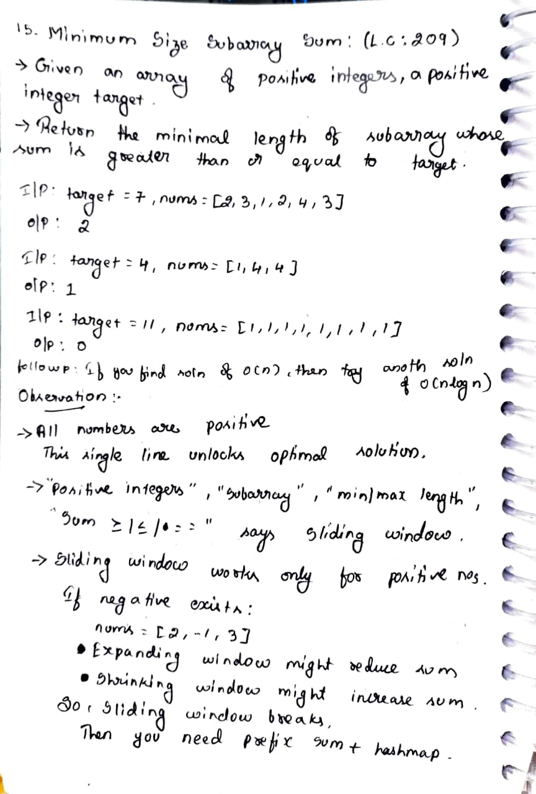
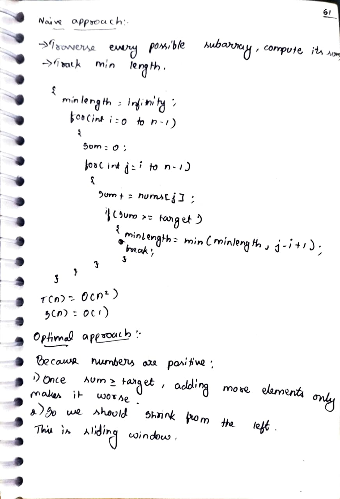
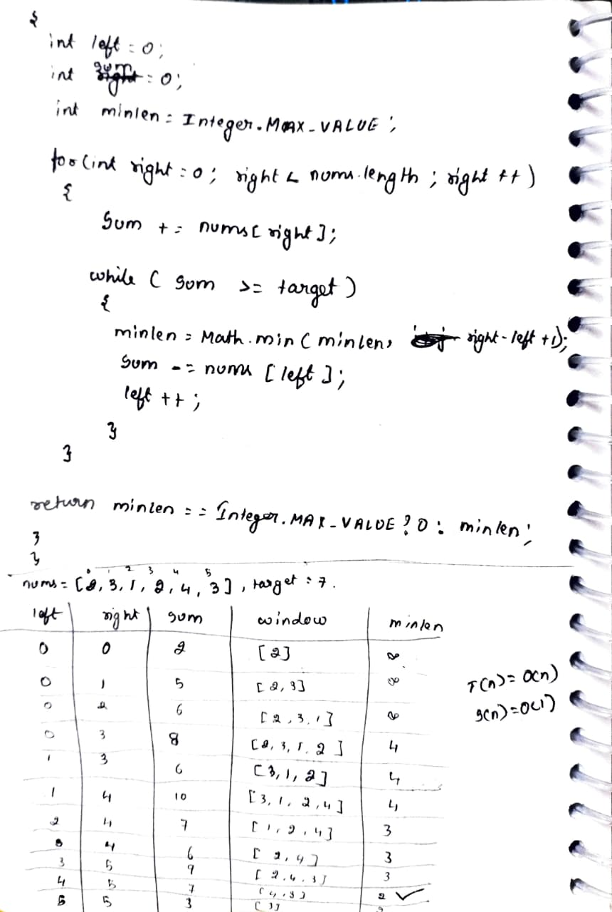
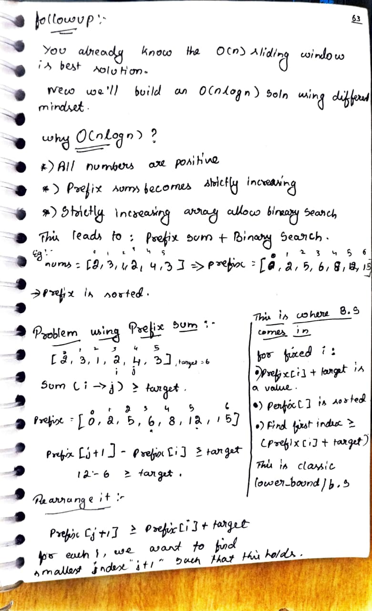
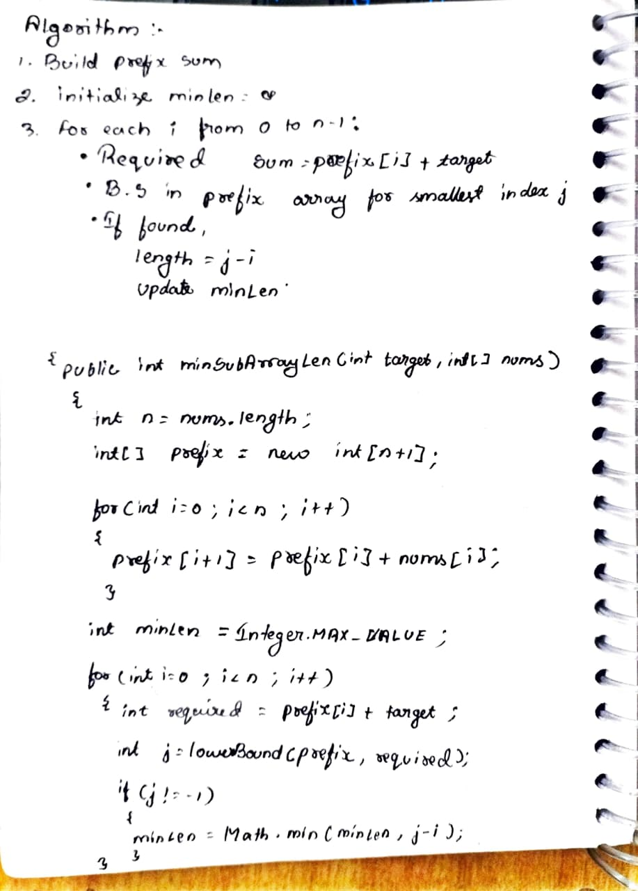
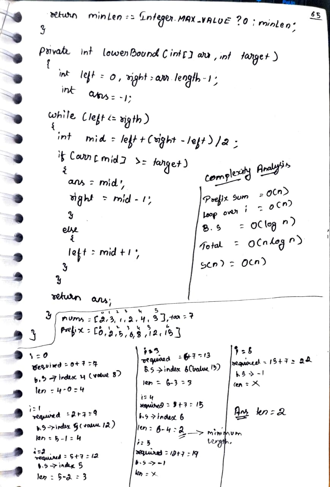

# 15. Minimum Size Subarray Sum

> **Platform:** [LeetCode](https://leetcode.com/problems/minimum-size-subarray-sum/description/) |  
> **Difficulty:** 🟡 a2_medium  
> **Topic Tags:** `Array` `Sliding Window` `Binary Search` `Prefix Sum`  
> **Date Solved:** 6-4-2026

---

## 📝 Problem Statement

> Given an array of positive integers `nums` and a positive integer `target`, return the **minimal length** of a subarray whose sum is greater than or equal to `target`.
> If no such subarray exists, return `0`.

**Example:**
```
Input:  target = 7, nums = [2, 3, 1, 2, 4, 3]
Output: 2  (subarray [4, 3])

Input:  target = 4, nums = [1, 4, 4]
Output: 1

Input:  target = 11, nums = [1, 1, 1, 1, 1, 1, 1, 1]
Output: 0
```

---

## 💡 Intuition

> **Key Observation:** All numbers are **positive**.
> This single fact unlocks the optimal solution.
>
> - Once `sum >= target`, adding more elements only **increases** the sum → makes it worse
> - So we should **shrink from the left** to find the minimum window
> - This is the **Sliding Window** pattern
>
> **Why Sliding Window only works for positive numbers:**  
> If negatives exist (e.g. `[2, -1, 3]`), expanding the window might reduce the sum.  
> In that case you need **Prefix Sum + HashMap**.
>
> **Follow-up O(n log n):**  
> Because all numbers are positive, prefix sums are **strictly increasing** → Binary Search is applicable.  
> Pattern: `Prefix Sum[j+1] ≥ Prefix Sum[i] + target` → find smallest such `j` using lower_bound.

---

## 🔄 Approaches

### 🐌 Brute Force
**Idea:**  
- Traverse every possible subarray starting at `i`
- Keep adding elements until sum ≥ target, track min length

**Time:** O(n²) | **Space:** O(1)

```java
class Solution {
    public int minSubArrayLen(int target, int[] nums) {
        int n = nums.length;
        int minLength = Integer.MAX_VALUE;

        for (int i = 0; i < n; i++) {
            int sum = 0;
            for (int j = i; j < n; j++) {
                sum += nums[j];
                if (sum >= target) {
                    minLength = Math.min(minLength, j - i + 1);
                    break;
                }
            }
        }

        return minLength == Integer.MAX_VALUE ? 0 : minLength;
    }
}
```

---

### ⚡ Optimal: Sliding Window
**Idea:**  
- Expand window by moving `right`
- When `sum >= target`, try shrinking from `left` to minimize window size

**Time:** O(n) | **Space:** O(1)

```java
class Solution {
    public int minSubArrayLen(int target, int[] nums) {
        int left = 0, sum = 0;
        int minLen = Integer.MAX_VALUE;

        for (int right = 0; right < nums.length; right++) {
            sum += nums[right];

            while (sum >= target) {
                minLen = Math.min(minLen, right - left + 1);
                sum -= nums[left];
                left++;
            }
        }

        return minLen == Integer.MAX_VALUE ? 0 : minLen;
    }
}
```

---

### 🔍 Follow-up: Prefix Sum + Binary Search O(n log n)
**Idea:**  
- Build prefix sum array (strictly increasing since all positive)
- For each `i`, find smallest `j` such that `prefix[j+1] - prefix[i] >= target`
- This reduces to: find first index `j+1` where `prefix[j+1] >= prefix[i] + target`
- Use Binary Search (lower_bound) on prefix array

**Time:** O(n log n) | **Space:** O(n)

```java
class Solution {
    public int minSubArrayLen(int target, int[] nums) {
        int n = nums.length;
        int[] prefix = new int[n + 1];
        for (int i = 0; i < n; i++) prefix[i + 1] = prefix[i] + nums[i];

        int minLen = Integer.MAX_VALUE;
        for (int i = 0; i < n; i++) {
            int required = prefix[i] + target;
            int j = lowerBound(prefix, required);
            if (j != -1) minLen = Math.min(minLen, j - i);
        }

        return minLen == Integer.MAX_VALUE ? 0 : minLen;
    }

    private int lowerBound(int[] arr, int target) {
        int left = 0, right = arr.length - 1, ans = -1;
        while (left <= right) {
            int mid = left + (right - left) / 2;
            if (arr[mid] >= target) { ans = mid; right = mid - 1; }
            else left = mid + 1;
        }
        return ans;
    }
}
```

---

## 📊 Complexity Analysis

| Approach | Time | Space |
|----------|------|-------|
| Brute | O(n²) | O(1) |
| Optimal (Sliding Window) | O(n) | O(1) |
| Follow-up (Prefix + BS) | O(n log n) | O(n) |

---

## 🗒 Personal Notes

> - 🔥 Best approach = Sliding Window (O(n))
> - **Sliding window only works for positive numbers** — key constraint to remember
> - Keyword triggers for Sliding Window: "positive integers", "subarray", "min/max length", "sum ≥ / ≤ / =="
> - If negatives exist → need Prefix Sum + HashMap
> - Follow-up O(n log n): prefix sums are sorted → binary search applicable
> - `lowerBound` finds smallest index with value ≥ target

---

## 🖊 Handwritten Notes








---
