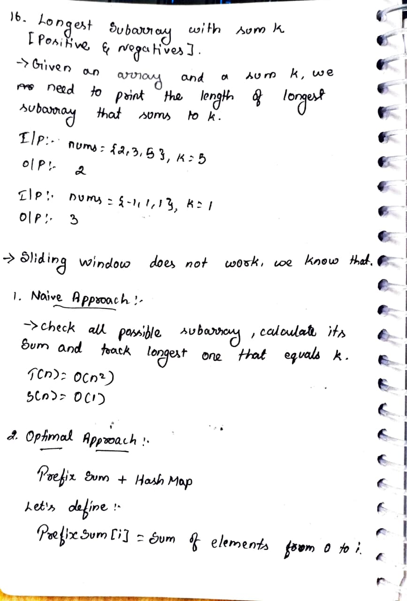
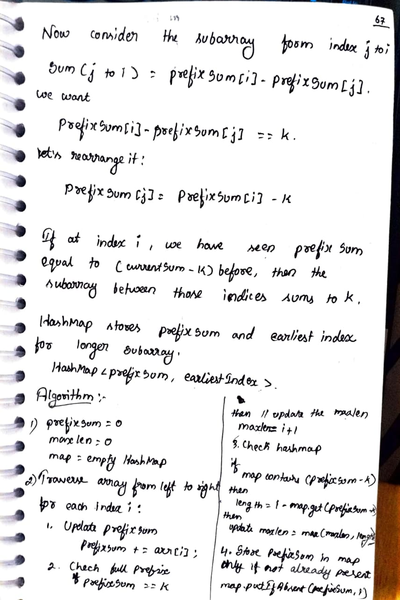
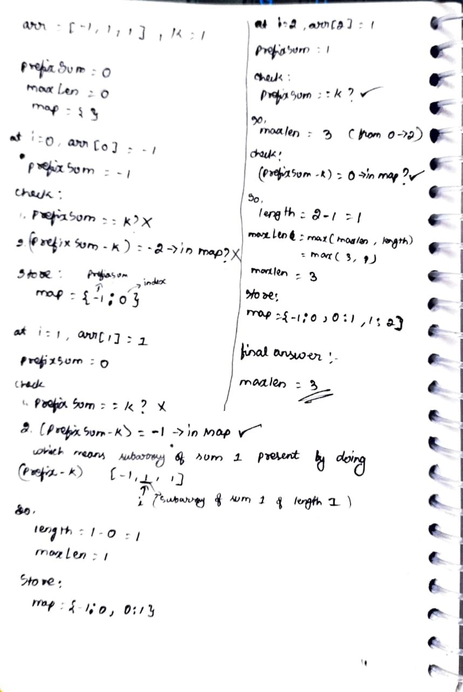
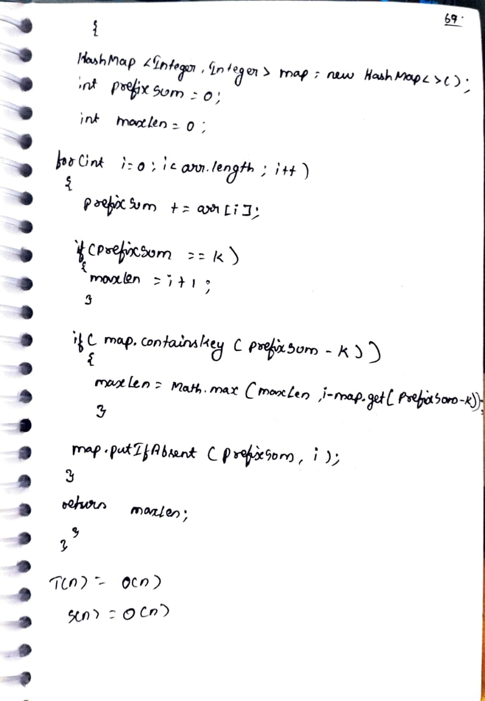

# 16. Longest Subarray with Sum K [Positives & Negatives]

> **Platform:** [GeeksForGeeks](https://www.geeksforgeeks.org/problems/longest-sub-array-with-sum-k0809/1) |  
> **Difficulty:** 🟡 a2_medium  
> **Topic Tags:** `Array` `HashMap` `Prefix Sum`  
> **Date Solved:** 6-4-2026

---

## 📝 Problem Statement

> Given an array `nums` (may contain positives and negatives) and a sum `k`,
> find the **length of the longest subarray** that sums to exactly `k`.

**Example:**
```
Input:  nums = [2, 3, 5], k = 5
Output: 2  (subarray [2, 3])

Input:  nums = [-1, 1, 1], k = 1
Output: 3  (subarray [-1, 1, 1])
```

---

## 💡 Intuition

> **Why Sliding Window won't work here:**  
> Sliding window only works when all elements are positive (expanding always increases sum).  
> With negatives: expanding might reduce sum, shrinking might increase it — window breaks.
>
> **Prefix Sum + HashMap:**  
> Define `prefixSum[i]` = sum of elements from index 0 to i.  
> Subarray from `j to i` sums to `k` means:  
> `prefixSum[i] - prefixSum[j-1] = k`  
> => `prefixSum[j-1] = prefixSum[i] - k`
>
> So at each index `i`, if we've seen `(currentPrefixSum - k)` before at index `j`,
> then `arr[j+1...i]` sums to `k`.
>
> **HashMap stores:** `{ prefixSum -> earliest index }`  
> Use `putIfAbsent` to preserve earliest index → gives longest subarray.

---

## 🔄 Approaches

### 🐌 Brute Force
**Idea:**  
- Check all possible subarrays
- Track longest one that sums to k

**Time:** O(n²) | **Space:** O(1)

```java
class Solution {
    public int longestSubarray(int[] arr, int k) {
        int n = arr.length;
        int maxLen = 0;

        for (int i = 0; i < n; i++) {
            int sum = 0;
            for (int j = i; j < n; j++) {
                sum += arr[j];
                if (sum == k) maxLen = Math.max(maxLen, j - i + 1);
            }
        }

        return maxLen;
    }
}
```

---

### ⚡ Optimal: Prefix Sum + HashMap
**Idea:**  
1. Initialize `prefixSum = 0`, `maxLen = 0`, `map = {}`
2. For each index `i`:
   - `prefixSum += arr[i]`
   - If `prefixSum == k`: `maxLen = i + 1` (whole subarray from 0 to i)
   - If `map` contains `(prefixSum - k)`: update `maxLen = max(maxLen, i - map.get(prefixSum - k))`
   - Store `prefixSum` in map only if not already present (`putIfAbsent`)

**Time:** O(n) | **Space:** O(n)

```java
class Solution {
    public int longestSubarray(int[] arr, int k) {
        HashMap<Integer, Integer> map = new HashMap<>();
        int prefixSum = 0;
        int maxLen = 0;

        for (int i = 0; i < arr.length; i++) {
            prefixSum += arr[i];

            if (prefixSum == k) {
                maxLen = i + 1;
            }

            if (map.containsKey(prefixSum - k)) {
                maxLen = Math.max(maxLen, i - map.get(prefixSum - k));
            }

            map.putIfAbsent(prefixSum, i);
        }

        return maxLen;
    }
}
```

---

## 📊 Complexity Analysis

| Approach | Time | Space |
|----------|------|-------|
| Brute | O(n²) | O(1) |
| Optimal (Prefix + HashMap) | O(n) | O(n) |

---

## 🗒 Personal Notes

> - 🔥 Best approach = Prefix Sum + HashMap
> - **Key formula:** `prefixSum[j] = prefixSum[i] - k` → subarray `(j, i]` sums to k
> - `putIfAbsent` is critical — we want the **earliest** index for **longest** subarray
> - `prefixSum == k` is a special case (subarray starts from index 0)
> - This differs from Problem 15 — here negatives exist so sliding window won't work
> - Pattern: Prefix Sum + HashMap for subarray sum problems with negatives

---

## 🖊 Handwritten Notes






---
