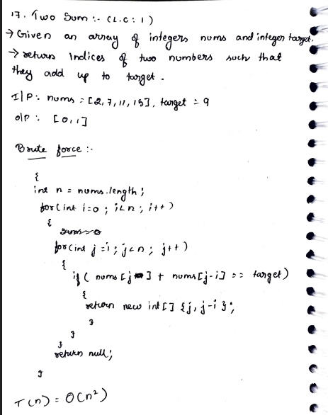
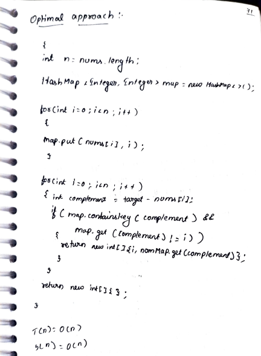

# 17. Two Sum

> **Platform:** [LeetCode](https://leetcode.com/problems/two-sum/) &nbsp;|&nbsp; LC: 1  
> **Difficulty:** 🟢 Easy  
> **Topic Tags:** `Array` `HashMap` `Two Pointers`  
> **Date Solved:** 8-4-2026

---

## 📝 Problem Statement

> Given an array of integers `nums` and an integer `target`, return **indices** of the two numbers such that they add up to `target`.

**Example:**
```
Input:  nums = [2, 7, 11, 15], target = 9
Output: [0, 1]
```

---

## 💡 Intuition

> **Brute Force:** Try every pair (i, j) and check if they sum to target.
>
> **Optimal (HashMap):** For each element, we need to find its *complement* (`target - nums[i]`).  
> Instead of scanning the whole array every time, store elements in a HashMap so lookups are O(1).  
> First pass builds the map; second pass checks if complement exists (and isn't the same index).

---

## 🔄 Approaches

### ⚡ Approach 1: Brute Force – Nested Loop
**Idea:** Try every pair (i, j) where j > i, check if `nums[i] + nums[j] == target`.  
**Time:** O(n²) | **Space:** O(1)

```java
class Solution {
    public int[] twoSum(int[] nums, int target) {
        int n = nums.length;
        for (int i = 0; i < n; i++) {
            for (int j = i + 1; j < n; j++) {
                if (nums[i] + nums[j] == target) {
                    return new int[]{i, j};
                }
            }
        }
        return null;
    }
}
```

---

### 🧠 Approach 2: Optimal – HashMap (Two-Pass)
**Idea:**
- Pass 1: Insert all `(nums[i] → i)` into a HashMap
- Pass 2: For each `nums[i]`, compute `complement = target - nums[i]`
- If complement exists in map **and** its index ≠ i → return `{i, map.get(complement)}`

**Time:** O(n) | **Space:** O(n)

```java
class Solution {
    public int[] twoSum(int[] nums, int target) {
        int n = nums.length;
        HashMap<Integer, Integer> map = new HashMap<>();

        for (int i = 0; i < n; i++) {
            map.put(nums[i], i);
        }

        for (int i = 0; i < n; i++) {
            int complement = target - nums[i];
            if (map.containsKey(complement) && map.get(complement) != i) {
                return new int[]{i, map.get(complement)};
            }
        }

        return new int[]{};
    }
}
```

---

## 📊 Complexity Analysis

| Approach | Time | Space |
|----------|------|-------|
| Brute Force | O(n²) | O(1) |
| HashMap (Optimal) | O(n) | O(n) |

---

## 🗒 Personal Notes

> - The key insight is using a HashMap for O(1) complement lookups
> - Two-pass is slightly cleaner; one-pass is also possible (check before inserting)
> - Always check that `map.get(complement) != i` to avoid using the same element twice
> - Pattern: **Complement Search with HashMap**

---

## 🖊 Handwritten Notes




---
