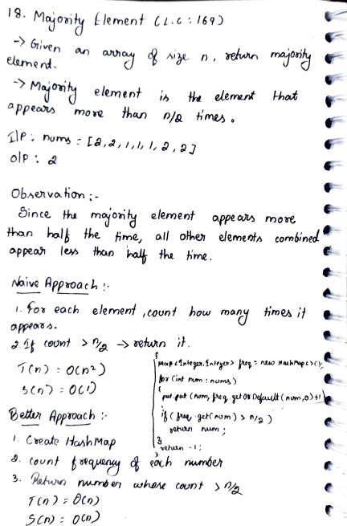
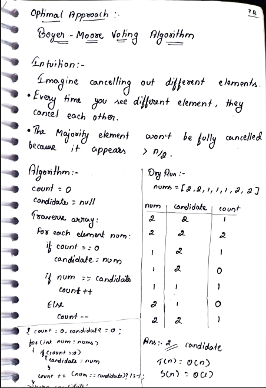

# 18. Majority Element

> **Platform:** [LeetCode](https://leetcode.com/problems/majority-element/) &nbsp;|&nbsp; LC: 169  
> **Difficulty:** 🟢 Easy  
> **Topic Tags:** `Array` `HashMap` `Boyer-Moore Voting`  
> **Date Solved:** 8-4-2026

---

## 📝 Problem Statement

> Given an array of size `n`, return the **majority element**.  
> The majority element is the element that appears **more than `n/2` times**.

**Example:**
```
Input:  nums = [2, 2, 1, 1, 1, 2, 2]
Output: 2
```

---

## 💡 Intuition

> **Observation:** Since the majority element appears more than half the time,
> all other elements combined appear less than half the time.
>
> **Naive:** For each element, count its frequency — O(n²).
>
> **Better (HashMap):** Count frequency of each number in one pass, return the one > n/2.
>
> **Optimal (Boyer-Moore Voting):** Imagine cancelling out different elements.
> Every time you see a different element, they cancel each other.
> The majority element **won't be fully cancelled** because it appears > n/2 times.

---

## 🔄 Approaches

### ⚡ Approach 1: Naive – Nested Loop
**Idea:** For each element, count how many times it appears. Return if count > n/2.  
**Time:** O(n²) | **Space:** O(1)

```java
class Solution {
    public int majorityElement(int[] nums) {
        int n = nums.length;
        for (int i = 0; i < n; i++) {
            int count = 0;
            for (int j = 0; j < n; j++) {
                if (nums[j] == nums[i]) count++;
            }
            if (count > n / 2) return nums[i];
        }
        return -1;
    }
}
```

---

### 🗺 Approach 2: Better – HashMap Frequency Count
**Idea:**
- Create a HashMap to count frequency of each number
- Return the number whose count > n/2

**Time:** O(n) | **Space:** O(n)

```java
class Solution {
    public int majorityElement(int[] nums) {
        HashMap<Integer, Integer> freq = new HashMap<>();
        for (int num : nums) {
            freq.put(num, freq.getOrDefault(num, 0) + 1);
        }
        for (int num : freq.keySet()) {
            if (freq.get(num) > nums.length / 2) return num;
        }
        return -1;
    }
}
```

---

### 🧠 Approach 3: Optimal – Boyer-Moore Voting Algorithm
**Idea:**
- Maintain a `candidate` and a `count`
- If `count == 0` → set `candidate = num`
- If `num == candidate` → `count++`
- Else → `count--`
- The final candidate is the majority element

**Dry Run** on `[2, 2, 1, 1, 1, 2, 2]`:

| num | candidate | count |
|-----|-----------|-------|
| 2   | 2         | 1     |
| 2   | 2         | 2     |
| 1   | 2         | 1     |
| 1   | 2         | 0     |
| 1   | 1         | 1     |
| 2   | 1         | 0     |
| 2   | 2         | 1     |

**Answer = 2 (candidate)**

**Time:** O(n) | **Space:** O(1)

```java
class Solution {
    public int majorityElement(int[] nums) {
        int count = 0, candidate = 0;
        for (int num : nums) {
            if (count == 0) candidate = num;
            count += (num == candidate) ? 1 : -1;
        }
        return candidate;
    }
}
```

---

## 📊 Complexity Analysis

| Approach | Time | Space |
|----------|------|-------|
| Naive (Nested Loop) | O(n²) | O(1) |
| HashMap | O(n) | O(n) |
| Boyer-Moore Voting | O(n) | O(1) |

---

## 🗒 Personal Notes

> - Boyer-Moore is the gold standard for this problem — O(n) time, O(1) space
> - The voting analogy: think of it as a political election where different candidates cancel each other out
> - The problem **guarantees** majority element exists — if it didn't, we'd need a verification pass
> - Pattern: **Boyer-Moore Voting Algorithm**

---

## 🖊 Handwritten Notes




---
