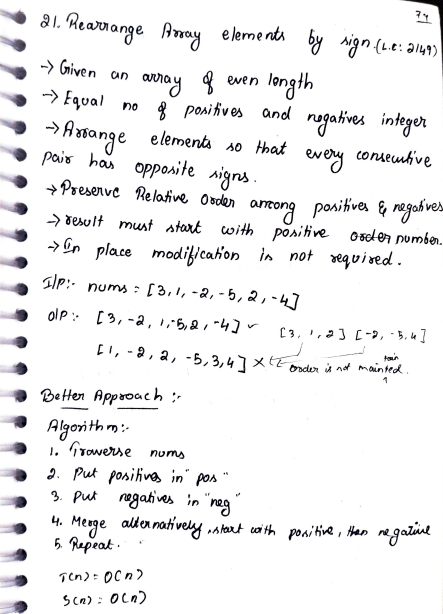
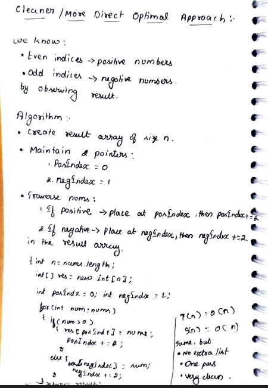

# 21. Rearrange Array Elements by Sign

> **Platform:** [LeetCode](https://leetcode.com/problems/rearrange-array-elements-by-sign/) &nbsp;|&nbsp; LC: 2149  
> **Difficulty:** 🟡 Medium  
> **Topic Tags:** `Array` `Two Pointers` `Simulation`  
> **Date Solved:** 8-4-2026

---

## 📝 Problem Statement

> Given an array of **even length** with an **equal number of positives and negatives**,
> rearrange elements so that every consecutive pair has opposite signs.
> - Preserve relative order among positives and among negatives
> - Result must start with a positive number
> - In-place modification is **not** required

**Example:**
```
Input:  nums = [3, 1, -2, -5, 2, -4]
Output: [3, -2, 1, -5, 2, -4]

Wrong:  [1, -2, 2, -5, 3, -4]  ← relative order not maintained
```

---

## 💡 Intuition

> **Better Approach:** Separate positives and negatives into two lists, then merge
> alternately starting with positive. Relative order is preserved in both lists.
>
> **Optimal Approach:** Observe the result pattern:
> - **Even indices (0, 2, 4, ...)** → positive numbers
> - **Odd indices (1, 3, 5, ...)** → negative numbers
>
> So maintain two pointers `posIndex = 0` and `negIndex = 1`,
> place each number directly in the result array in one pass.
> Same complexity but no extra lists — cleaner and more direct.

---

## 🔄 Approaches

### ⚡ Approach 1: Better – Separate Lists
**Idea:**
1. Traverse nums → put positives in `pos`, negatives in `neg`
2. Merge alternately: `result[2i] = pos[i]`, `result[2i+1] = neg[i]`

**Time:** O(n) | **Space:** O(n)

```java
class Solution {
    public int[] rearrangeArray(int[] nums) {
        List<Integer> pos = new ArrayList<>(), neg = new ArrayList<>();
        for (int num : nums) {
            if (num > 0) pos.add(num); else neg.add(num);
        }
        int[] result = new int[nums.length];
        for (int i = 0; i < nums.length / 2; i++) {
            result[2 * i]     = pos.get(i);
            result[2 * i + 1] = neg.get(i);
        }
        return result;
    }
}
```

---

### 🧠 Approach 2: Optimal – Two Pointers (Cleaner & More Direct)
**Idea:**
- Create `res[]` of size n
- `posIndex = 0`, `negIndex = 1`
- For each num: if positive → `res[posIndex] = num; posIndex += 2`
- If negative → `res[negIndex] = num; negIndex += 2`

Advantages over Approach 1: no extra list creation, one pass, very clean.

**Time:** O(n) | **Space:** O(n) — same, but no extra list

```java
class Solution {
    public int[] rearrangeArray(int[] nums) {
        int n = nums.length;
        int[] res = new int[n];
        int posIndex = 0, negIndex = 1;
        for (int num : nums) {
            if (num > 0) { res[posIndex] = num; posIndex += 2; }
            else         { res[negIndex] = num; negIndex += 2; }
        }
        return res;
    }
}
```

---

## 📊 Complexity Analysis

| Approach | Time | Space |
|----------|------|-------|
| Separate Lists | O(n) | O(n) |
| Two Pointers (Optimal) | O(n) | O(n) — result array only |

---

## 🗒 Personal Notes

> - Both are O(n) time & space, but the two-pointer approach avoids creating extra lists
> - Key observation: even indices → positive, odd indices → negative
> - The problem guarantees equal positives and negatives, so no boundary issues
> - Pattern: **Two Pointers on Result Array**

---

## 🖊 Handwritten Notes




---
