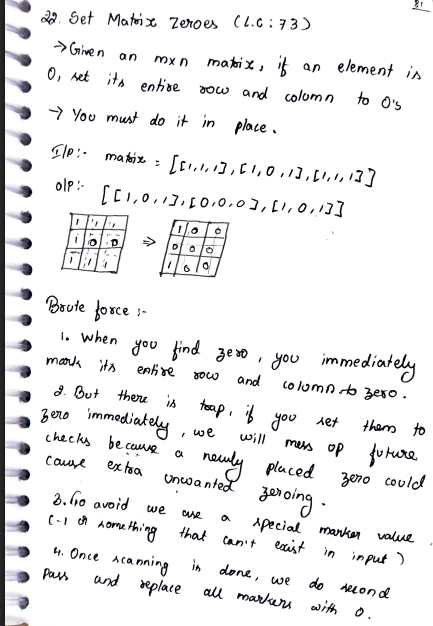
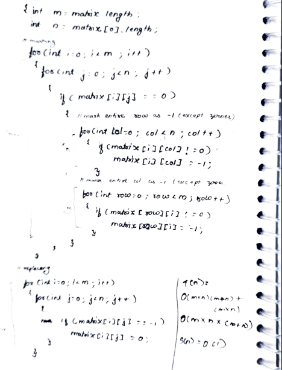
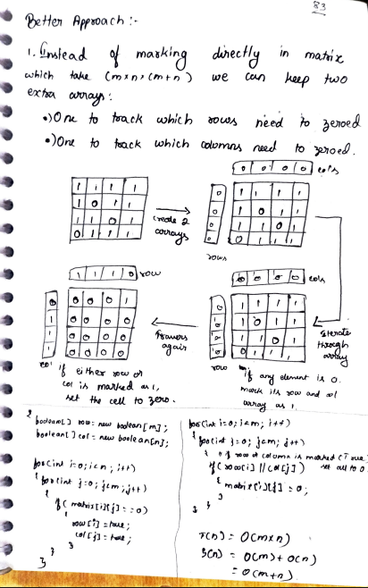

# 22. Set Matrix Zeroes

> **Platform:** [LeetCode](https://leetcode.com/problems/set-matrix-zeroes/) &nbsp;|&nbsp; LC: 73  
> **Difficulty:** 🟡 Medium  
> **Topic Tags:** `Array` `Matrix` `Hash Table`  
> **Date Solved:** 8-4-2026

---

## 📝 Problem Statement

> Given an `m × n` matrix, if an element is `0`, set its **entire row and column to 0's**.  
> You must do it **in place**.

**Example:**
```
Input:  [[1,1,1],[1,0,1],[1,1,1]]
Output: [[1,0,1],[0,0,0],[1,0,1]]
```

---

## 💡 Intuition

> **Brute Force Trap:** If you set row/column to 0 immediately when you find a 0,
> newly placed zeroes cause extra unintended zeroing in future checks.
> Fix: use a special marker value (like -1) to separate original from new zeroes.
>
> **Better:** Use two boolean arrays `row[]` and `col[]` to track which rows/cols need zeroing.
>
> **Optimal:** Instead of two extra arrays, use the **1st row and 1st column of the matrix itself** as markers.
> But there's a catch — `matrix[0][0]` belongs to BOTH first row and first col, so handle them separately
> with two boolean flags: `firstRowZero` and `firstColZero`.

---

## 🔄 Approaches

### ⚡ Approach 1: Brute Force – Marker Value (-1)
**Idea:**
1. Find a 0 → mark entire row & col as -1 (skip existing 0s)
2. Second pass: replace all -1 with 0

**Trap avoided:** Newly placed -1s won't be mistaken for original 0s.  
**Time:** O(m×n × (m+n)) | **Space:** O(1)

---

### 🗺 Approach 2: Better – Two Boolean Arrays
**Idea:**
- `row[i] = true` if row i contains a 0
- `col[j] = true` if col j contains a 0
- Second pass: set `matrix[i][j] = 0` if `row[i] || col[j]`

**Time:** O(m×n) | **Space:** O(m+n)

```java
class Solution {
    public void setZeroes(int[][] matrix) {
        int m = matrix.length, n = matrix[0].length;
        boolean[] row = new boolean[m], col = new boolean[n];
        for (int i = 0; i < m; i++)
            for (int j = 0; j < n; j++)
                if (matrix[i][j] == 0) { row[i] = true; col[j] = true; }
        for (int i = 0; i < m; i++)
            for (int j = 0; j < n; j++)
                if (row[i] || col[j]) matrix[i][j] = 0;
    }
}
```

---

### 🧠 Approach 3: Optimal – Use 1st Row & 1st Col as Markers
**Idea:**
1. Check if 1st row / 1st col **themselves** contain 0 → store in `firstRowZero`, `firstColZero`
2. Scan from `(1,1)` to `(m-1, n-1)`: if `matrix[i][j] == 0`, mark `matrix[i][0] = 0` and `matrix[0][j] = 0`
3. Apply zeroes from `(1,1)` using those markers
4. Finally zero 1st row/col if `firstRowZero` / `firstColZero` is true

**Time:** O(m×n) | **Space:** O(1)

```java
class Solution {
    public void setZeroes(int[][] matrix) {
        int m = matrix.length, n = matrix[0].length;
        boolean firstRowZero = false, firstColZero = false;

        for (int j = 0; j < n; j++) if (matrix[0][j] == 0) { firstRowZero = true; break; }
        for (int i = 0; i < m; i++) if (matrix[i][0] == 0) { firstColZero = true; break; }

        for (int i = 1; i < m; i++)
            for (int j = 1; j < n; j++)
                if (matrix[i][j] == 0) { matrix[i][0] = 0; matrix[0][j] = 0; }

        for (int i = 1; i < m; i++)
            for (int j = 1; j < n; j++)
                if (matrix[i][0] == 0 || matrix[0][j] == 0) matrix[i][j] = 0;

        if (firstRowZero) for (int j = 0; j < n; j++) matrix[0][j] = 0;
        if (firstColZero) for (int i = 0; i < m; i++) matrix[i][0] = 0;
    }
}
```

---

## 📊 Complexity Analysis

| Approach | Time | Space |
|----------|------|-------|
| Brute Force (Marker -1) | O(m×n×(m+n)) | O(1) |
| Two Boolean Arrays | O(m×n) | O(m+n) |
| First Row/Col as Markers | O(m×n) | O(1) |

---

## 🗒 Personal Notes

> - The `matrix[0][0]` ambiguity is the trickiest part of the optimal approach
> - Always process 1st row/col **last** to avoid corrupting the markers
> - Pattern: **In-Place Matrix Manipulation using Row/Col Markers**

---

## 🖊 Handwritten Notes





---
