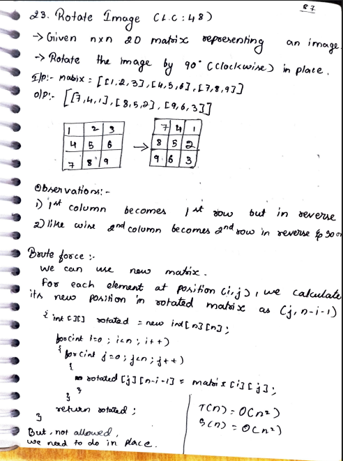
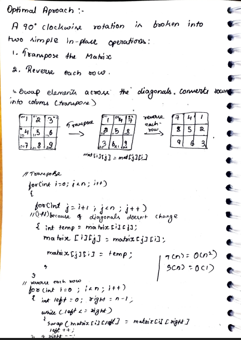

# 23. Rotate Image

> **Platform:** [LeetCode](https://leetcode.com/problems/rotate-image/) &nbsp;|&nbsp; LC: 48  
> **Difficulty:** 🟡 Medium  
> **Topic Tags:** `Array` `Matrix` `Math`  
> **Date Solved:** 8-4-2026

---

## 📝 Problem Statement

> Given an `n × n` 2D matrix representing an image, **rotate the image by 90° clockwise** in place.

**Example:**
```
Input:  [[1,2,3],[4,5,6],[7,8,9]]
Output: [[7,4,1],[8,5,2],[9,6,3]]
```

---

## 💡 Intuition

> **Brute Force:** For each element at `(i, j)`, its new position is `(j, n-i-1)`.
> Use an extra matrix. But the problem requires in-place — **not allowed**.
>
> **Optimal Observation:**
> 1. The 1st column becomes the 1st row (but in reverse)
> 2. The 2nd column becomes the 2nd row (in reverse)
>
> A 90° clockwise rotation can be broken into two simple in-place operations:
> 1. **Transpose** the matrix (swap across diagonal: `mat[i][j] ↔ mat[j][i]`)
> 2. **Reverse each row**

---

## 🔄 Approaches

### ⚡ Approach 1: Brute Force – Extra Matrix
**Idea:** `rotated[j][n-i-1] = matrix[i][j]` for each (i, j).  
**Time:** O(n²) | **Space:** O(n²) — but NOT in-place, so not acceptable.

---

### 🧠 Approach 2: Optimal – Transpose + Reverse Rows (In-Place)
**Idea:**

```
Original:          Transpose:         Reverse Rows:
1  2  3            1  4  7            7  4  1
4  5  6   ──────►  2  5  8   ──────►  8  5  2
7  8  9            3  6  9            9  6  3
```

- Transpose: `mat[i][j] = mat[j][i]` (j starts from i+1 to skip diagonal)
- Reverse: use two pointers left/right per row

**Time:** O(n²) | **Space:** O(1)

```java
class Solution {
    public void rotate(int[][] matrix) {
        int n = matrix.length;

        // Step 1: Transpose
        for (int i = 0; i < n; i++)
            for (int j = i + 1; j < n; j++) {
                int temp = matrix[i][j];
                matrix[i][j] = matrix[j][i];
                matrix[j][i] = temp;
            }

        // Step 2: Reverse each row
        for (int i = 0; i < n; i++) {
            int left = 0, right = n - 1;
            while (left <= right) {
                int temp = matrix[i][left];
                matrix[i][left] = matrix[i][right];
                matrix[i][right] = temp;
                left++; right--;
            }
        }
    }
}
```

---

## 📊 Complexity Analysis

| Approach | Time | Space |
|----------|------|-------|
| Brute Force (Extra Matrix) | O(n²) | O(n²) |
| Transpose + Reverse (Optimal) | O(n²) | O(1) |

---

## 🗒 Personal Notes

> - The transpose + reverse trick is the key insight — learn it cold
> - For **counter-clockwise** rotation: reverse each row first, then transpose
> - `j = i+1` in transpose because diagonal elements (`matrix[i][i]`) don't change
> - Pattern: **Matrix Transpose + Row Reversal**

---

## 🖊 Handwritten Notes




---
