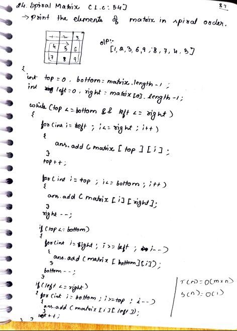

# 24. Spiral Matrix

> **Platform:** [LeetCode](https://leetcode.com/problems/spiral-matrix/) &nbsp;|&nbsp; LC: 54  
> **Difficulty:** 🟡 Medium  
> **Topic Tags:** `Array` `Matrix` `Simulation`  
> **Date Solved:** 8-4-2026

---

## 📝 Problem Statement

> Given an `m × n` matrix, return all elements of the matrix in **spiral order**.

**Example:**
```
Input:  [[1,2,3],[4,5,6],[7,8,9]]
Output: [1,2,3,6,9,8,7,4,5]
```

---

## 💡 Intuition

> Think of the matrix as having shrinking boundaries.
> Maintain 4 boundary pointers: `top`, `bottom`, `left`, `right`.
>
> In each iteration, traverse 4 directions:
> 1. **Left → Right** along `top` row, then `top++`
> 2. **Top → Bottom** along `right` column, then `right--`
> 3. **Right → Left** along `bottom` row (if top ≤ bottom), then `bottom--`
> 4. **Bottom → Top** along `left` column (if left ≤ right), then `left++`
>
> Continue until `top > bottom` or `left > right`.

---

## 🔄 Approach: Four-Boundary Simulation

```
→ → →
        ↓
← ← ↓
↑       ↓
↑ ←  ←
```

**Time:** O(m×n) | **Space:** O(1) — excluding output list

```java
class Solution {
    public List<Integer> spiralOrder(int[][] matrix) {
        List<Integer> ans = new ArrayList<>();
        int top = 0, bottom = matrix.length - 1;
        int left = 0, right = matrix[0].length - 1;

        while (top <= bottom && left <= right) {
            // Left → Right (top row)
            for (int i = left; i <= right; i++) ans.add(matrix[top][i]);
            top++;

            // Top → Bottom (right col)
            for (int i = top; i <= bottom; i++) ans.add(matrix[i][right]);
            right--;

            // Right → Left (bottom row)
            if (top <= bottom) {
                for (int i = right; i >= left; i--) ans.add(matrix[bottom][i]);
                bottom--;
            }

            // Bottom → Top (left col)
            if (left <= right) {
                for (int i = bottom; i >= top; i--) ans.add(matrix[i][left]);
                left++;
            }
        }
        return ans;
    }
}
```

---

## 📊 Complexity Analysis

| Approach | Time | Space |
|----------|------|-------|
| Four-Boundary Simulation | O(m×n) | O(1) |

---

## 🗒 Personal Notes

> - The `if (top <= bottom)` and `if (left <= right)` guards prevent double-counting in single-row or single-column matrices
> - Each element is visited exactly once
> - Pattern: **Layer-by-Layer Boundary Shrinking Simulation**

---

## 🖊 Handwritten Notes



---
