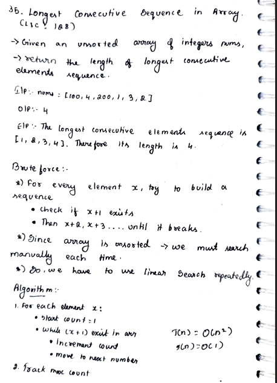
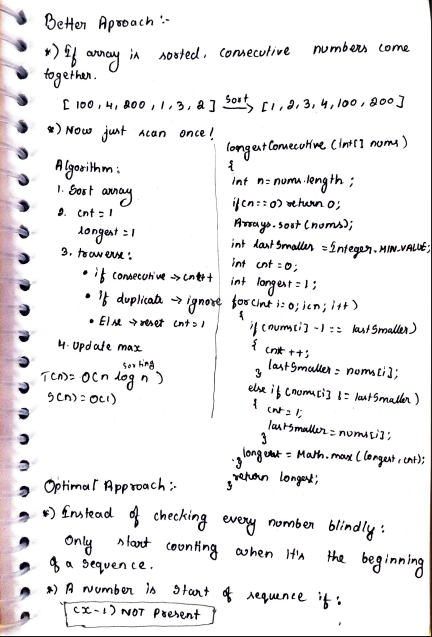
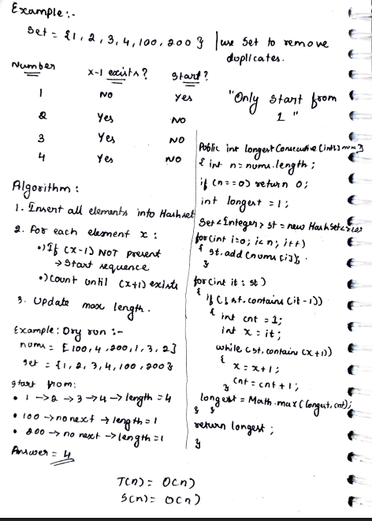

# 27. Longest Consecutive Sequence in Array

> **Platform:** [LeetCode 128](https://leetcode.com/problems/longest-consecutive-sequence/description/) | [GeeksForGeeks](https://www.geeksforgeeks.org/problems/longest-consecutive-subsequence2449/1) |  
> **Difficulty:** 🟡 Medium  
> **Topic Tags:** `Array` `HashSet`  
> **Date Solved:** 9-4-2026

---

## 📝 Problem Statement

> Given an **unsorted** array of integers `nums`, return the **length of the longest consecutive elements sequence**.

**Example:**
```
Input:  nums = [100, 4, 200, 1, 3, 2]
Output: 4
Explanation: Longest consecutive sequence is [1, 2, 3, 4] → length 4.
```

---

## 💡 Intuition

> **Brute Force:** For every element x, repeatedly search for x+1, x+2... Since array is unsorted, each search is O(n) → O(n²) overall.
>
> **Sorting (Better):** If sorted, consecutive elements are adjacent. One pass with a counter: extend if `nums[i]-1 == lastSmaller`, reset if new element, skip if duplicate. O(n log n).
>
> **HashSet (Optimal):**  
> Key insight → **only start counting when `x-1` is NOT in the set**.  
> This means `x` is the beginning of a sequence, not a middle.  
> Without this check, we'd recount sequences from every element.  
> - Insert all elements into a HashSet.  
> - For each element, if `x-1` is absent → start sequence, count while `x+1` exists.  
> - Track max length. O(n) overall despite nested loop — each element is visited at most twice.

---

## 🔄 Approaches

### 🐌 Brute Force — Linear Search
**Idea:** For each x, linearly search x+1, x+2... until not found.  
**Time:** O(n²) | **Space:** O(1)

```java
class Solution {
    public int longestConsecutive(int[] nums) {
        int longest = 1;
        for (int i = 0; i < nums.length; i++) {
            int x = nums[i], cnt = 1;
            while (linearSearch(nums, x + 1)) { x++; cnt++; }
            longest = Math.max(longest, cnt);
        }
        return longest;
    }

    private boolean linearSearch(int[] nums, int target) {
        for (int num : nums) if (num == target) return true;
        return false;
    }
}
```

---

### 🧠 Better — Sort + Single Pass
**Idea:** Sort the array, then scan once tracking consecutive run.  
**Time:** O(n log n) | **Space:** O(1)

```java
class Solution {
    public int longestConsecutive(int[] nums) {
        int n = nums.length;
        if (n == 0) return 0;

        Arrays.sort(nums);
        int lastSmaller = Integer.MIN_VALUE, cnt = 0, longest = 1;

        for (int i = 0; i < n; i++) {
            if (nums[i] - 1 == lastSmaller) {
                cnt++;
                lastSmaller = nums[i];
            } else if (nums[i] != lastSmaller) {
                cnt = 1;
                lastSmaller = nums[i];
            }
            longest = Math.max(longest, cnt);
        }

        return longest;
    }
}
```

---

### ⚡ Optimal — HashSet
**Idea:** Only start counting from sequence beginnings (where `x-1` ∉ set).  
**Time:** O(n) | **Space:** O(n)

```java
class Solution {
    public int longestConsecutive(int[] nums) {
        if (nums.length == 0) return 0;

        int longest = 1;
        Set<Integer> st = new HashSet<>();
        for (int num : nums) st.add(num);

        for (int it : st) {
            if (!st.contains(it - 1)) {  // it is a sequence start
                int cnt = 1, x = it;
                while (st.contains(x + 1)) { x++; cnt++; }
                longest = Math.max(longest, cnt);
            }
        }

        return longest;
    }
}
```

**Dry Run: nums = [100, 4, 200, 1, 3, 2]**
```
Set = {1, 2, 3, 4, 100, 200}
1 → (1-1=0 not in set) → start! count: 1→2→3→4 → length 4 ✅
100 → (99 not in set) → start! no 101 → length 1
200 → (199 not in set) → start! no 201 → length 1
Answer = 4
```

---

## 📊 Complexity Analysis

| Approach | Time | Space |
|----------|------|-------|
| Brute (Linear Search) | O(n²) | O(1) |
| Better (Sorting) | O(n log n) | O(1) |
| Optimal (HashSet) | O(n) | O(n) |

---

## 🗒 Personal Notes

> - 🔥 Best approach = HashSet with sequence-start check
> - **Critical trick:** `(x-1) NOT in set` → x is sequence start → avoids redundant counting
> - Each element is processed at most twice (once as start, once inside a while loop) → O(n) total
> - Use HashSet to get O(1) lookup instead of O(n) linear search
> - Pattern: HashSet for O(1) membership check on unsorted data

---

## 🖊 Handwritten Notes





---
