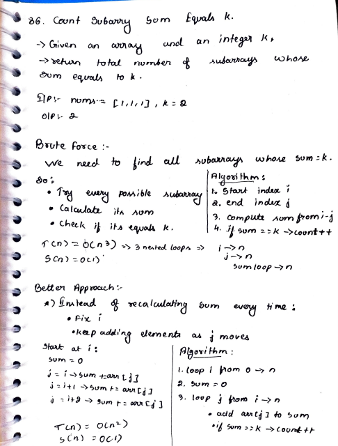
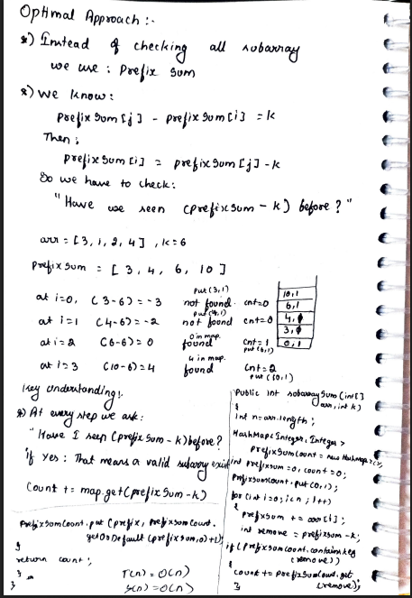

# 28. Count Subarray Sum Equals K

> **Platform:** [LeetCode 560](https://leetcode.com/problems/subarray-sum-equals-k/description/) | [GeeksForGeeks](https://www.geeksforgeeks.org/problems/subarrays-with-sum-k/1) |  
> **Difficulty:** 🟡 Medium  
> **Topic Tags:** `Array` `HashMap` `Prefix Sum`  
> **Date Solved:** 9-4-2026

---

## 📝 Problem Statement

> Given an array `nums` and an integer `k`, return the **total number of subarrays** whose sum equals `k`.

**Example:**
```
Input:  nums = [1, 1, 1], k = 2
Output: 2
Explanation: [1,1] at index 0-1 and [1,1] at index 1-2.
```

---

## 💡 Intuition

> **Brute (3 loops):** Try every (i, j) pair and recompute sum for each → O(n³).
>
> **Better (2 loops):** Fix start index `i`, keep adding elements at `j` → running sum, no recompute → O(n²).
>
> **Optimal (Prefix Sum + HashMap):**  
> We know: `prefixSum[j] - prefixSum[i] = k`  
> → `prefixSum[i] = prefixSum[j] - k`
>
> At each index `j`, we ask: **"Have we seen (prefixSum - k) before?"**  
> If yes → each previous occurrence is a valid subarray ending at `j`.  
> → `count += map.get(prefixSum - k)`
>
> HashMap stores `{prefixSum → frequency}`.  
> Initialize with `{0: 1}` to handle subarrays starting from index 0.

---

## 🔄 Approaches

### 🐌 Brute Force — 3 Nested Loops
**Idea:** All (i, j) pairs, recompute sum each time.  
**Time:** O(n³) | **Space:** O(1)

```java
class Solution {
    public int subarraySum(int[] arr, int k) {
        int n = arr.length, count = 0;
        for (int i = 0; i < n; i++) {
            for (int j = i; j < n; j++) {
                int sum = 0;
                for (int l = i; l <= j; l++) sum += arr[l];
                if (sum == k) count++;
            }
        }
        return count;
    }
}
```

---

### 🧠 Better — 2 Nested Loops
**Idea:** Fix `i`, extend `j` with running sum.  
**Time:** O(n²) | **Space:** O(1)

```java
class Solution {
    public int subarraySum(int[] arr, int k) {
        int n = arr.length, count = 0;
        for (int i = 0; i < n; i++) {
            int sum = 0;
            for (int j = i; j < n; j++) {
                sum += arr[j];
                if (sum == k) count++;
            }
        }
        return count;
    }
}
```

---

### ⚡ Optimal — Prefix Sum + HashMap
**Algorithm:**
1. Initialize `prefixSumCount = {0: 1}`, `prefixSum = 0`, `count = 0`
2. For each element `arr[i]`:
   - `prefixSum += arr[i]`
   - `remove = prefixSum - k`
   - If `remove` in map → `count += map.get(remove)`
   - `map.put(prefixSum, map.getOrDefault(prefixSum, 0) + 1)`
3. Return `count`

**Time:** O(n) | **Space:** O(n)

```java
class Solution {
    public int subarraySum(int[] arr, int k) {
        Map<Integer, Integer> prefixSumCount = new HashMap<>();
        int prefixSum = 0, count = 0;

        prefixSumCount.put(0, 1); // base case: empty subarray

        for (int i = 0; i < arr.length; i++) {
            prefixSum += arr[i];

            int remove = prefixSum - k;
            if (prefixSumCount.containsKey(remove)) {
                count += prefixSumCount.get(remove);
            }

            prefixSumCount.put(prefixSum,
                    prefixSumCount.getOrDefault(prefixSum, 0) + 1);
        }

        return count;
    }
}
```

**Dry Run: arr = [3,1,2,4], k = 6**
```
prefixSum sequence: [3, 4, 6, 10]
Map initially: {0:1}

i=0: prefixSum=3,  remove=3-6=-3,  not in map. map={0:1, 3:1}
i=1: prefixSum=4,  remove=4-6=-2,  not in map. map={0:1, 3:1, 4:1}
i=2: prefixSum=6,  remove=6-6=0,   found! cnt+=1. map={..., 6:1}
i=3: prefixSum=10, remove=10-6=4,  found! cnt+=1. map={..., 10:1}

Answer = 2 ✅ ([3,1,2] and [2,4])
```

---

## 📊 Complexity Analysis

| Approach | Time | Space |
|----------|------|-------|
| Brute (3 loops) | O(n³) | O(1) |
| Better (2 loops) | O(n²) | O(1) |
| Optimal (Prefix + HashMap) | O(n) | O(n) |

---

## 🗒 Personal Notes

> - 🔥 Best approach = Prefix Sum + HashMap
> - **Key formula:** `prefixSum[i] = prefixSum[j] - k` → subarray (i, j] sums to k
> - `{0: 1}` initialization is critical — handles subarrays that start from index 0 (whole prefix)
> - Works for negative numbers too (unlike sliding window which only works for positives)
> - This is the **count** version of "Longest Subarray with Sum K" (p16) — same prefix sum idea
> - Pattern: Prefix Sum + HashMap for counting subarrays with target sum

---

## 🖊 Handwritten Notes




---
