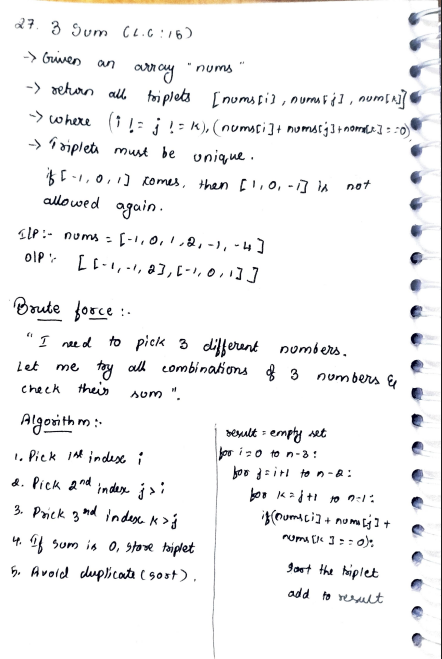
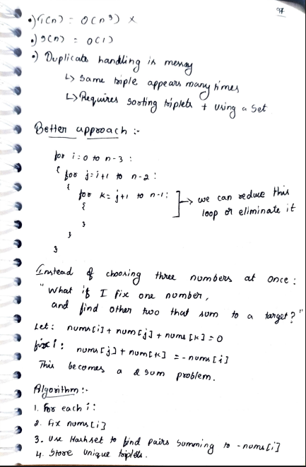
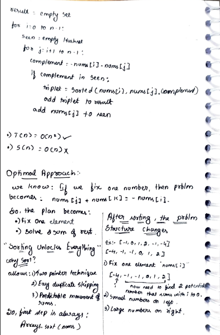
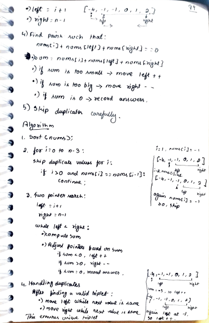
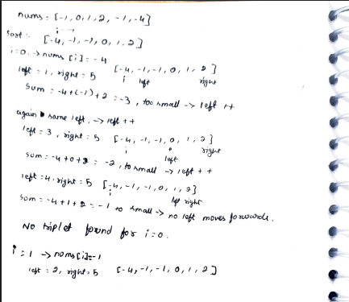
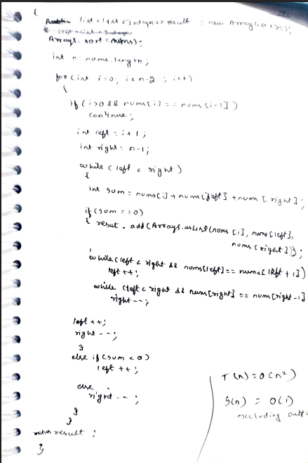

# p31. Three Sum

> **Platform:** [LeetCode 15](https://leetcode.com/problems/3sum/) |  
> **Difficulty:** 🟡 Medium  
> **Topic Tags:** `Array` `Two Pointers` `Sorting`  
> **Date Solved:** 9-4-2026

---

## 📝 Problem Statement

> Given an integer array `nums`, return all the **unique triplets** `[a, b, c]` such that `a + b + c == 0`. The solution set must not contain duplicate triplets.

**Example:**
```
Input:  nums = [-1, 0, 1, 2, -1, -4]
Output: [[-1, -1, 2], [-1, 0, 1]]
```

---

## 💡 Intuition

> **Brute:** Try all (i, j, k) combos. Use a Set of sorted triplets to deduplicate → O(n³).
>
> **Better:** Fix i, use HashSet to find the third element for each j → O(n²) but O(n) space.
>
> **Optimal (Sort + Two Pointers):**  
> Sort the array. Fix `i`, use two pointers `j = i+1`, `k = n-1`.  
> - `sum < 0` → move `j` right (need larger value)  
> - `sum > 0` → move `k` left (need smaller value)  
> - `sum == 0` → found triplet, skip duplicates for `j` and `k`  
> Skip duplicate `i` values at the start. Early break if `nums[i] > 0`.

---

## 🔄 Approaches

### 🐌 Brute — 3 Nested Loops
**Time:** O(n³ log n) | **Space:** O(n)
```java
// Try all combinations, store sorted triplets in Set
```

### 🧠 Better — HashSet for Third Element
**Time:** O(n²) | **Space:** O(n)
```java
// Fix i, use HashSet to find -(nums[i]+nums[j])
```

### ⚡ Optimal — Sort + Two Pointers
**Time:** O(n²) | **Space:** O(1)
```java
class Solution {
    public List<List<Integer>> threeSum(int[] nums) {
        Arrays.sort(nums);
        List<List<Integer>> result = new ArrayList<>();

        for (int i = 0; i < nums.length - 2; i++) {
            if (i > 0 && nums[i] == nums[i - 1]) continue; // skip dup i
            if (nums[i] > 0) break;                          // early exit

            int j = i + 1, k = nums.length - 1;
            while (j < k) {
                int sum = nums[i] + nums[j] + nums[k];
                if      (sum < 0) j++;
                else if (sum > 0) k--;
                else {
                    result.add(Arrays.asList(nums[i], nums[j], nums[k]));
                    j++; k--;
                    while (j < k && nums[j] == nums[j - 1]) j++; // skip dup j
                    while (j < k && nums[k] == nums[k + 1]) k--; // skip dup k
                }
            }
        }
        return result;
    }
}
```

---

## 📊 Complexity Analysis

| Approach | Time | Space |
|----------|------|-------|
| Brute (3 loops) | O(n³ log n) | O(n) |
| Better (HashSet) | O(n²) | O(n) |
| Optimal (Two Pointers) | O(n²) | O(1) |

---

## 🗒 Personal Notes

> - 🔥 Best approach = Sort + Two Pointers
> - Three duplicate-skip rules: skip `i`, skip `j`, skip `k` after finding triplet
> - `if (nums[i] > 0) break` → sorted array, all subsequent sums will be positive
> - Pattern: Fix one element, Two Pointers for the rest — generalizes to k-Sum

---

## 🖊 Handwritten Notes








---
