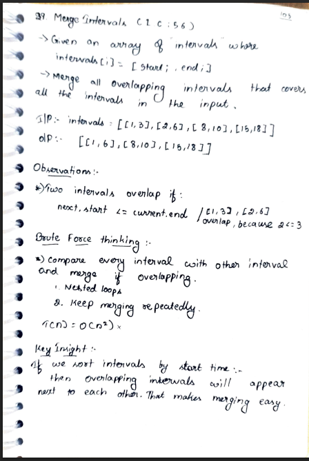
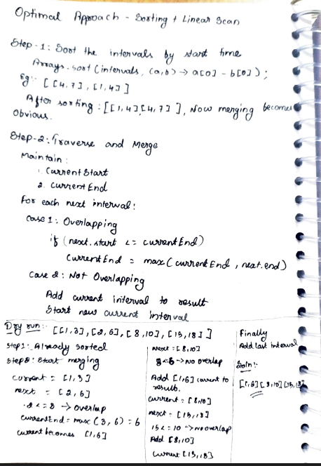
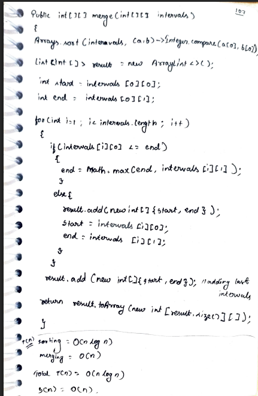
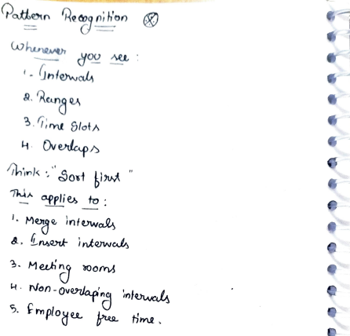

# p33. Merge Intervals

> **Platform:** [LeetCode 56](https://leetcode.com/problems/merge-intervals/) |  
> **Difficulty:** 🟡 Medium  
> **Topic Tags:** `Array` `Sorting`  
> **Date Solved:** 9-4-2026

---

## 📝 Problem Statement

> Given an array of `intervals` where `intervals[i] = [start, end]`, merge all **overlapping intervals**, and return an array of the non-overlapping intervals.

**Example:**
```
Input:  [[1,3],[2,6],[8,10],[15,18]]
Output: [[1,6],[8,10],[15,18]]

Input:  [[1,4],[4,5]]
Output: [[1,5]]   (touching intervals merge)
```

---

## 💡 Intuition

> **Sort by start time** so overlapping intervals are adjacent.  
> Maintain a `current` interval. For each next interval:  
> - If `next.start <= current.end` → they overlap → merge: `current.end = max(current.end, next.end)`  
> - Else → no overlap → save `current`, set `current = next`  
> Add the last `current` after the loop.

---

## 🔄 Approach

### ⚡ Optimal — Sort + Linear Merge
**Time:** O(n log n) | **Space:** O(n)

```java
class Solution {
    public int[][] merge(int[][] intervals) {
        Arrays.sort(intervals, (a, b) -> a[0] - b[0]);
        List<int[]> result = new ArrayList<>();
        int[] current = intervals[0];

        for (int i = 1; i < intervals.length; i++) {
            if (intervals[i][0] <= current[1]) {
                current[1] = Math.max(current[1], intervals[i][1]);
            } else {
                result.add(current);
                current = intervals[i];
            }
        }

        result.add(current);
        return result.toArray(new int[result.size()][]);
    }
}
```

---

## 📊 Complexity Analysis

| Approach | Time | Space |
|----------|------|-------|
| Brute (all pairs check) | O(n²) | O(n) |
| Optimal (Sort + merge) | O(n log n) | O(n) |

---

## 🗒 Personal Notes

> - 🔥 Sort is the key — makes overlapping intervals adjacent
> - Overlap condition: `next.start <= current.end` (touching intervals also merge)
> - Merge: take `max` of the two end values (not just the next one — could be fully contained)
> - Don't forget to `result.add(current)` after the loop for the last interval
> - Pattern: Sort + Greedy linear scan

---

## 🖊 Handwritten Notes






---
