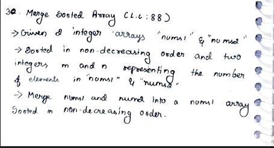
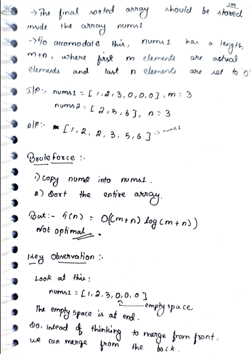
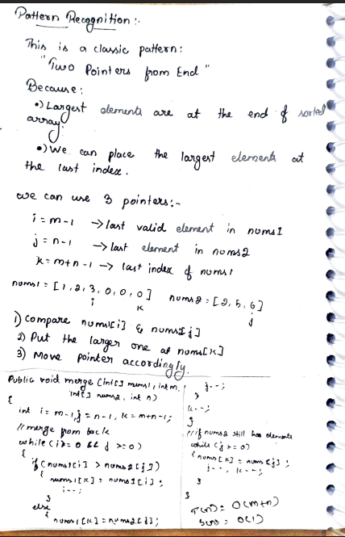

# p34. Merge Sorted Array

> **Platform:** [LeetCode 88](https://leetcode.com/problems/merge-sorted-array/) |  
> **Difficulty:** 🟢 Easy  
> **Topic Tags:** `Array` `Two Pointers` `Sorting`  
> **Date Solved:** 9-4-2026

---

## 📝 Problem Statement

> You are given two integer arrays `nums1` and `nums2`, sorted in non-decreasing order, and integers `m` and `n` representing the number of elements in each. Merge `nums2` into `nums1` as one sorted array **in-place**. `nums1` has a length of `m + n`, with the last `n` slots initialized to 0.

**Example:**
```
Input:  nums1 = [1,2,3,0,0,0], m = 3, nums2 = [2,5,6], n = 3
Output: [1, 2, 2, 3, 5, 6]
```

---

## 💡 Intuition

> **Naive:** Copy nums2 into the extra space in nums1, then sort → O((m+n) log(m+n)).
>
> **Optimal (Fill from Back):**  
> Since nums1 has extra space at the end, fill from the **back** to avoid overwriting.  
> Use three pointers: `i = m-1`, `j = n-1`, `k = m+n-1`.  
> Pick the larger of `nums1[i]` and `nums2[j]`, place at `nums1[k]`, decrement both.  
> After the loop, copy any remaining `nums2` elements (nums1 elements are already in place).

---

## 🔄 Approaches

### 🐌 Naive — Copy then Sort
**Time:** O((m+n) log(m+n)) | **Space:** O(1)
```java
// Copy nums2 into end of nums1, then Arrays.sort(nums1)
```

### ⚡ Optimal — Fill from Back (3 Pointers)
**Time:** O(m+n) | **Space:** O(1)

```java
class Solution {
    public void merge(int[] nums1, int m, int[] nums2, int n) {
        int i = m - 1, j = n - 1, k = m + n - 1;

        while (i >= 0 && j >= 0) {
            if (nums1[i] >= nums2[j]) nums1[k--] = nums1[i--];
            else                       nums1[k--] = nums2[j--];
        }

        while (j >= 0) nums1[k--] = nums2[j--];
    }
}
```

---

## 📊 Complexity Analysis

| Approach | Time | Space |
|----------|------|-------|
| Naive (copy + sort) | O((m+n) log(m+n)) | O(1) |
| Optimal (fill from back) | O(m+n) | O(1) |

---

## 🗒 Personal Notes

> - 🔥 Fill from the back — avoids overwriting unprocessed elements
> - No need to handle remaining `nums1` elements — they're already in correct position
> - Do handle remaining `nums2` elements — copy them to front of nums1
> - Pattern: Two-pointer merge from back for in-place sorted array merging

---

## 🖊 Handwritten Notes





---
