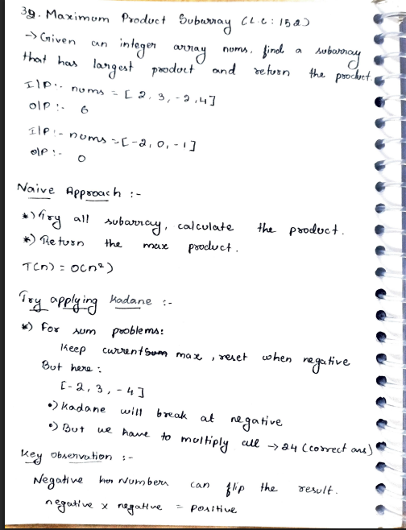
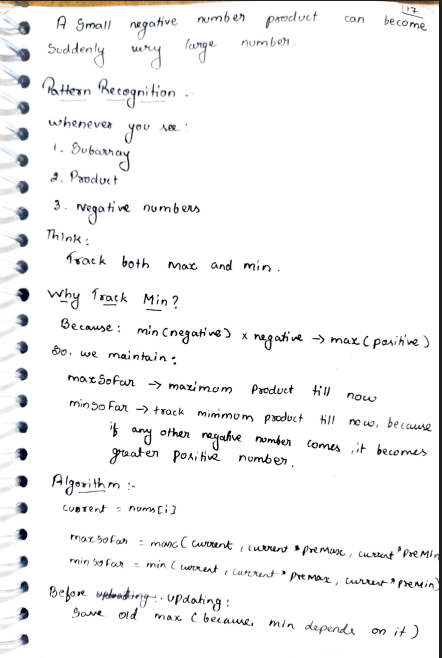
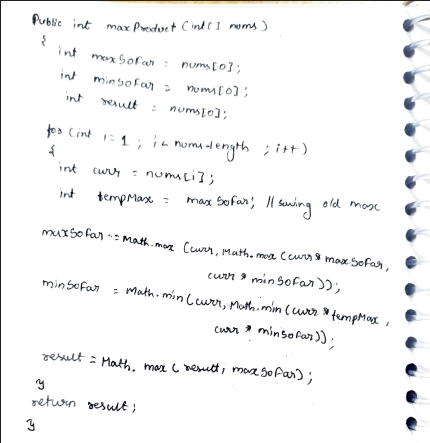

# p36. Maximum Product Subarray

> **Platform:** [LeetCode 152](https://leetcode.com/problems/maximum-product-subarray/) |  
> **Difficulty:** 🟡 Medium  
> **Topic Tags:** `Array` `Dynamic Programming`  
> **Date Solved:** 9-4-2026

---

## 📝 Problem Statement

> Given an integer array `nums`, find the **subarray that has the largest product**, and return its product.

**Example:**
```
Input:  nums = [2, 3, -2, 4]  →  Output: 6   (subarray [2,3])
Input:  nums = [-2, 3, -4]    →  Output: 24  (subarray [-2,3,-4])
```

---

## 💡 Intuition

> **Why not just track max?** A negative number can turn the minimum product into the maximum (negative × negative = positive). So we must track both `maxProd` and `minProd` at each step.
>
> **Key cases:**
> - Current element > 0: `maxProd` grows, `minProd` stays negative or shrinks
> - Current element < 0: `maxProd` and `minProd` **swap** (neg × neg = pos)
> - Current element = 0: both reset — start fresh
>
> **Prefix-Suffix approach (elegant):**  
> Traverse from both ends. Any valid max-product subarray is either a prefix or suffix of some range. Reset to 1 on zero (zeros divide the array).

---

## 🔄 Approaches

### 🐌 Brute — All Subarrays
**Time:** O(n²) | **Space:** O(1)
```java
// Try all (i,j) pairs, compute running product
```

### ⚡ Optimal — Track Max and Min
**Time:** O(n) | **Space:** O(1)
```java
class Solution {
    public int maxProduct(int[] nums) {
        int maxProd = nums[0], minProd = nums[0], result = nums[0];

        for (int i = 1; i < nums.length; i++) {
            if (nums[i] < 0) {
                int temp = maxProd; maxProd = minProd; minProd = temp;
            }
            maxProd = Math.max(nums[i], maxProd * nums[i]);
            minProd = Math.min(nums[i], minProd * nums[i]);
            result  = Math.max(result, maxProd);
        }
        return result;
    }
}
```

### ⚡ Prefix-Suffix (Alternative O(n), O(1))
```java
class Solution {
    public int maxProduct(int[] nums) {
        int n = nums.length, result = Integer.MIN_VALUE;
        int prefix = 1, suffix = 1;
        for (int i = 0; i < n; i++) {
            prefix *= nums[i];
            suffix *= nums[n - 1 - i];
            result = Math.max(result, Math.max(prefix, suffix));
            if (prefix == 0) prefix = 1;
            if (suffix == 0) suffix = 1;
        }
        return result;
    }
}
```

---

## 📊 Complexity Analysis

| Approach | Time | Space |
|----------|------|-------|
| Brute | O(n²) | O(1) |
| Track Max & Min | O(n) | O(1) |
| Prefix-Suffix | O(n) | O(1) |

---

## 🗒 Personal Notes

> - 🔥 Key insight: negative × negative = positive → track min product too
> - Swap `maxProd` and `minProd` when current element is negative
> - Zero resets everything — `Math.max(nums[i], maxProd * nums[i])` handles this
> - Prefix-Suffix: zeros split the array — reset to 1 on zero
> - Pattern: DP with two states (max and min) for product problems

---

## 🖊 Handwritten Notes





---
