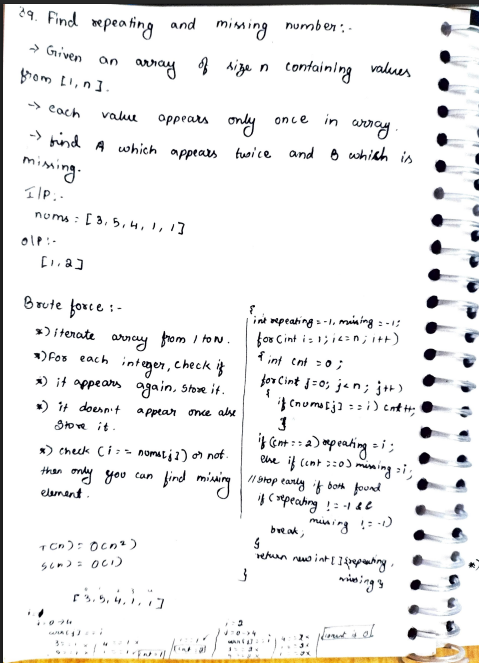
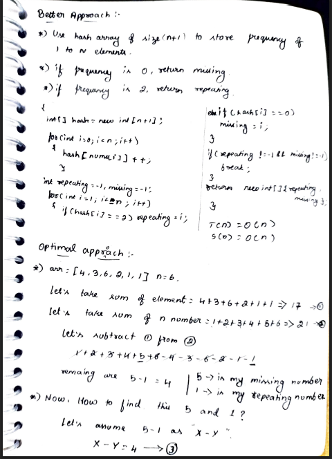
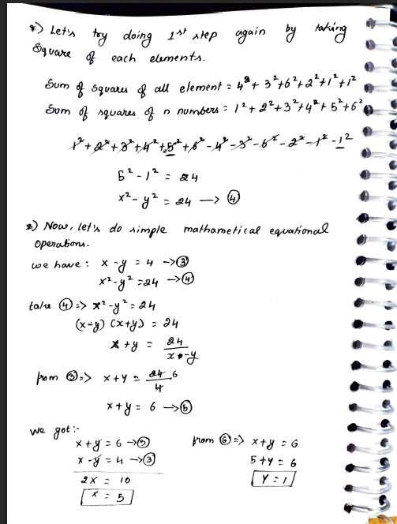
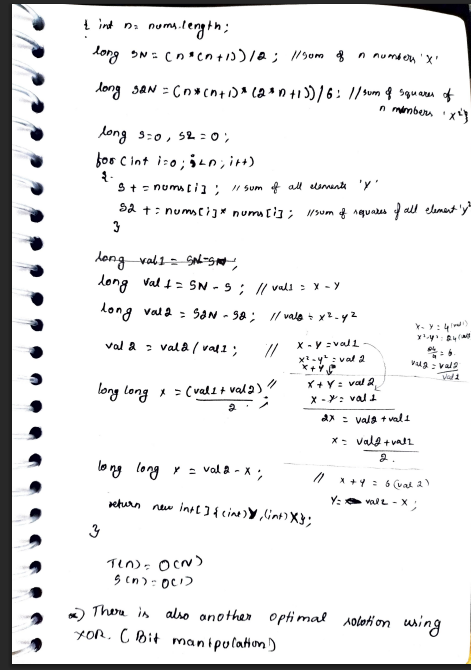
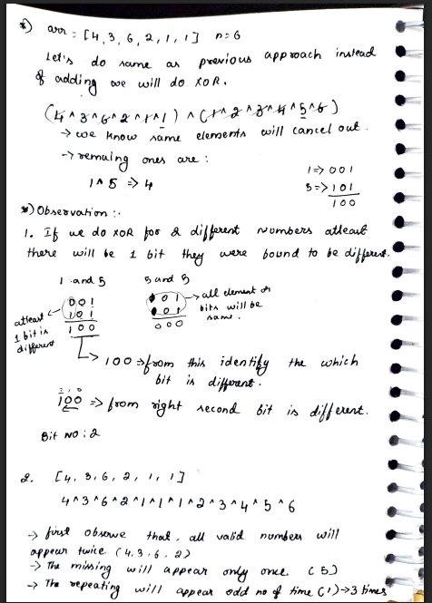
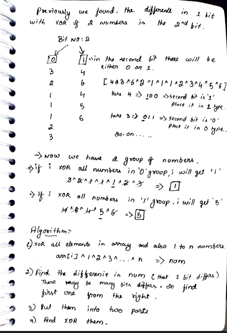
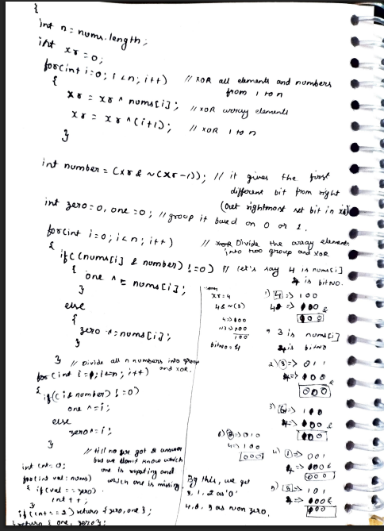

# 39. Find the Repeating and Missing Numbers

> **Platform:** [TakeUForward](https://takeuforward.org/arrays/find-the-repeating-and-missing-numbers/) |  
> **Difficulty:** 🟡 Medium  
> **Topic Tags:** `Array` `Math` `Bit Manipulation` `Hashing`  
> **Date Solved:** 9-4-2026

---

## 📝 Problem Statement

> Given an integer array `nums` of size `n` containing values from `[1, n]`, where each value appears **exactly once** except for **A** (appears twice) and **B** (is missing).  
> Return `[A, B]` — the repeating and the missing number.

**Example:**
```
Input:  nums[] = {3, 1, 2, 5, 4, 6, 7, 5}
Output: Repeating = 5, Missing = 8
```

---

## 💡 Intuition

> **Brute Force:** For each number 1 to N, do a linear scan and count occurrences. O(n²) but uses no extra space.
>
> **Better (Hash Array):** Use a frequency array of size N+1. One pass to fill it, one pass to find repeating (freq=2) and missing (freq=0). O(n) time but O(n) space.
>
> **Optimal (Math):** Use the formula for sum (Sn) and sum of squares (S2n) of first N naturals. Two equations with two unknowns (X, Y) can be solved directly. O(n) time, O(1) space.
>
> **Optimal (XOR):** XOR all elements and 1..N to get `X ^ Y`. Use the rightmost set bit to split into two groups; XOR within each group isolates X and Y. O(n) time, O(1) space.

---

## 🔄 Approaches

### ⚡ Approach 1: Brute Force – Linear Search Count
**Idea:** For each number `i` from 1 to N, count how many times it appears in the array.  
**Time:** O(n²) | **Space:** O(1)

```java
class Solution {
    public int[] findBrute(int[] nums) {
        int n = nums.length;
        int repeating = -1, missing = -1;

        for (int i = 1; i <= n; i++) {
            int count = 0;
            for (int j = 0; j < n; j++) {
                if (nums[j] == i) count++;
            }
            if (count == 2) repeating = i;
            else if (count == 0) missing = i;
            if (repeating != -1 && missing != -1) break;
        }

        return new int[]{repeating, missing};
    }
}
```

---

### 🗂 Approach 2: Better – Hash Array (Frequency Map)
**Idea:** Declare a hash array of size N+1. Increment `hash[nums[i]]` for every element. Then scan hash to find freq==2 (repeating) and freq==0 (missing).  
**Time:** O(n) | **Space:** O(n)

```java
class Solution {
    public int[] findBetter(int[] nums) {
        int n = nums.length;
        int[] hash = new int[n + 1];

        for (int num : nums) hash[num]++;

        int repeating = -1, missing = -1;
        for (int i = 1; i <= n; i++) {
            if (hash[i] == 2) repeating = i;
            else if (hash[i] == 0) missing = i;
            if (repeating != -1 && missing != -1) break;
        }

        return new int[]{repeating, missing};
    }
}
```

---

### 🧮 Approach 3: Optimal 1 – Math (Sum & Sum of Squares)
**Idea:**
- Let X = repeating, Y = missing
- `S - Sn = X - Y`  &nbsp;&nbsp; (diff of actual vs expected sum)
- `S2 - S2n = X² - Y²` &nbsp;&nbsp; (diff of actual vs expected sum of squares)
- Divide → `X + Y = (S2 - S2n) / (S - Sn)`
- Solve: `X = ((X+Y) + (X-Y)) / 2`, &nbsp; `Y = X - (X-Y)`

**Time:** O(n) | **Space:** O(1)

```java
class Solution {
    public int[] findOptimalMath(int[] nums) {
        long n = nums.length;
        long Sn  = (n * (n + 1)) / 2;
        long S2n = (n * (n + 1) * (2 * n + 1)) / 6;

        long S = 0, S2 = 0;
        for (int num : nums) { S += num; S2 += (long) num * num; }

        long diffXY = S - Sn;
        long sumXY  = (S2 - S2n) / diffXY;

        long X = (sumXY + diffXY) / 2;
        long Y = X - diffXY;

        return new int[]{(int) X, (int) Y};
    }
}
```

---

### 🔀 Approach 4: Optimal 2 – XOR Bit Manipulation
**Idea:**
- XOR all elements + 1..N → `xr = X ^ Y`
- Find rightmost set bit of `xr`
- Split all elements and 1..N into two groups by that bit position
- XOR within each group → isolates X and Y
- Count occurrences of one result in array to identify repeating vs missing

**Time:** O(n) | **Space:** O(1)

```java
class Solution {
    public int[] findOptimalXOR(int[] nums) {
        int n = nums.length, xr = 0;
        for (int num : nums) xr ^= num;
        for (int i = 1; i <= n; i++) xr ^= i;

        int setBit = xr & ~(xr - 1);
        int zero = 0, one = 0;

        for (int num : nums) {
            if ((num & setBit) != 0) one ^= num;
            else zero ^= num;
        }
        for (int i = 1; i <= n; i++) {
            if ((i & setBit) != 0) one ^= i;
            else zero ^= i;
        }

        int countZero = 0;
        for (int num : nums) if (num == zero) countZero++;

        if (countZero == 2) return new int[]{zero, one};
        else return new int[]{one, zero};
    }
}
```

---

## 📊 Complexity Analysis

| Approach | Time | Space |
|----------|------|-------|
| Brute Force | O(n²) | O(1) |
| Better (Hash Array) | O(n) | O(n) |
| Optimal (Math) | O(n) | O(1) |
| Optimal (XOR) | O(n) | O(1) |

---

## 🗒 Personal Notes

> - Math approach: use `long` to avoid integer overflow when computing sum of squares
> - XOR approach: `xr & ~(xr - 1)` isolates the rightmost set bit cleanly
> - Both optimal approaches are O(n) time and O(1) space — XOR preferred in interviews for its elegance
> - Math approach: two equations, two unknowns → always solvable
> - Key insight in XOR: X and Y differ at the chosen bit position, so they always land in opposite groups

---
## 🖊 Handwritten Notes









