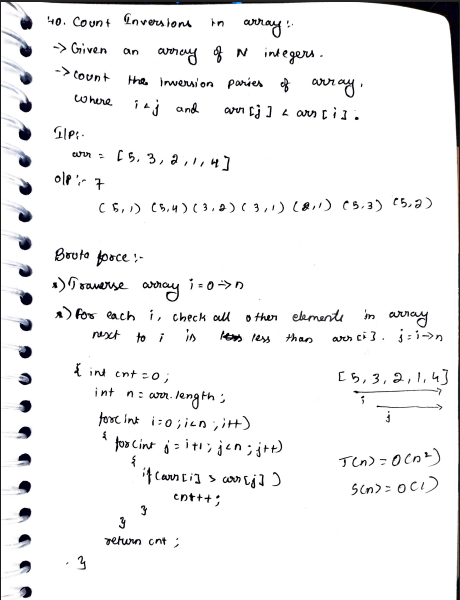
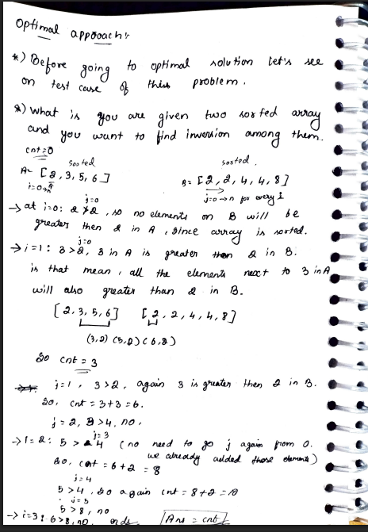
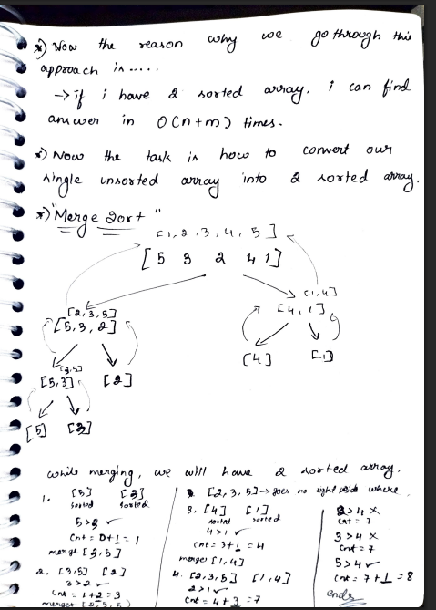
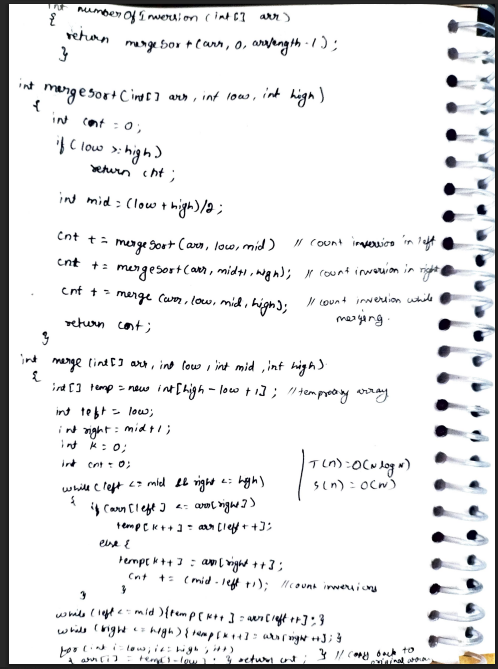

# 40. Count Inversions in an Array

> **Platform:** [TakeUForward](https://takeuforward.org/data-structure/count-inversions-in-an-array/) |  
> **Difficulty:** 🟡 Medium  
> **Topic Tags:** `Array` `Divide and Conquer` `Merge Sort`  
> **Date Solved:** 9-4-2026

---

## 📝 Problem Statement

> Given an array of `N` integers, count the number of **inversions** in the array.  
> An inversion is a pair `(i, j)` such that `i < j` and `arr[i] > arr[j]`.

**Example:**
```
Input:  arr[] = {5, 4, 3, 2, 1}
Output: 10
```

---

## 💡 Intuition

> **Brute Force:** Compare every pair (i, j) with i < j. If arr[i] > arr[j], it's an inversion. Simple but O(n²).
>
> **Optimal (Merge Sort):** During the merge step of merge sort, if `arr[left] > arr[right]`, then ALL remaining elements in the left half (from `left` to `mid`) are also greater than `arr[right]`. So we can count `(mid - left + 1)` inversions in a single step. This brings the total complexity to O(n log n).

---

## 🔄 Approaches

### ⚡ Approach 1: Brute Force – Nested Loops
**Idea:** For each element `arr[i]`, scan all elements to its right and count how many are smaller.  
**Time:** O(n²) | **Space:** O(1)

```java
class Solution {
    public int countInversionsBrute(int[] arr) {
        int n = arr.length, cnt = 0;

        for (int i = 0; i < n; i++) {
            for (int j = i + 1; j < n; j++) {
                if (arr[i] > arr[j]) cnt++;
            }
        }

        return cnt;
    }
}
```

---

### 🧠 Approach 2: Optimal – Merge Sort
**Idea:**
- Recursively split the array into left and right halves
- During `merge`, if `arr[left] > arr[right]`:
  - All elements `arr[left..mid]` are also greater than `arr[right]`
  - Add `(mid - left + 1)` to the count in one step
- Total inversions = left inversions + right inversions + cross inversions

**Time:** O(n log n) | **Space:** O(n) – temporary array

```java
class Solution {
    public int merge(int[] arr, int low, int mid, int high) {
        int[] temp = new int[high - low + 1];
        int left = low, right = mid + 1, k = 0, cnt = 0;

        while (left <= mid && right <= high) {
            if (arr[left] <= arr[right]) {
                temp[k++] = arr[left++];
            } else {
                temp[k++] = arr[right++];
                cnt += (mid - left + 1);
            }
        }

        while (left <= mid)   temp[k++] = arr[left++];
        while (right <= high) temp[k++] = arr[right++];

        for (int i = low; i <= high; i++) arr[i] = temp[i - low];
        return cnt;
    }

    public int mergeSort(int[] arr, int low, int high) {
        if (low >= high) return 0;

        int mid = (low + high) / 2;
        int cnt = 0;

        cnt += mergeSort(arr, low, mid);
        cnt += mergeSort(arr, mid + 1, high);
        cnt += merge(arr, low, mid, high);

        return cnt;
    }

    public int countInversions(int[] arr) {
        return mergeSort(arr, 0, arr.length - 1);
    }
}
```

---

## 📊 Complexity Analysis

| Approach | Time | Space |
|----------|------|-------|
| Brute Force | O(n²) | O(1) |
| Merge Sort (Optimal) | O(n log n) | O(n) |

---

## 🗒 Personal Notes

> - Key insight: during merge, left and right halves are already sorted → if `arr[left] > arr[right]`, ALL of `arr[left..mid]` > `arr[right]`, giving `(mid - left + 1)` inversions instantly
> - Merge sort modifies the original array — clone before using if original is needed
> - For a sorted array: 0 inversions; for reverse sorted array: n*(n-1)/2 inversions
> - This pattern (counting during merge) is reused in problems like "Count Reverse Pairs"
> - Pattern: Divide & Conquer — split, count in halves, count across during merge

---



