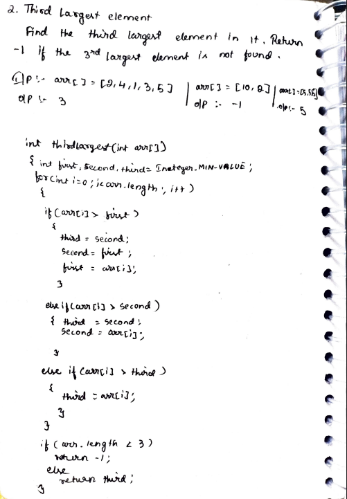

# 2. Third Largest Element

> **Platform:** [GeeksForGeeks](https://www.geeksforgeeks.org/problems/third-largest-element/1) |  
> **LeetCode:** No direct equivalent (see LC 215 for Kth Largest) |  
> **Difficulty:** 🟢 Easy  
> **Topic Tags:** `Array`  
> **Date Solved:** 7-4-2026

---

## 📝 Problem Statement

> Find the **third largest element** in an array. Return `-1` if the third largest element does not exist (i.e., array has fewer than 3 elements).

**Example:**
```
Input:  arr[] = [2, 4, 1, 3, 5]
Output: 3

Input:  arr[] = [10, 2]
Output: -1

Input:  arr[] = [5, 5, 8]  (note: GFG version allows duplicates)
Output: 5
```

---

## 💡 Intuition

> Maintain three variables: `first`, `second`, `third` initialized to `Integer.MIN_VALUE`.
> In a single pass:
> - If `arr[i] > first`: cascade down — `third = second`, `second = first`, `first = arr[i]`
> - Else if `arr[i] > second`: `third = second`, `second = arr[i]`
> - Else if `arr[i] > third`: `third = arr[i]`
>
> After traversal, if array length < 3 return `-1`, else return `third`.

---

## 🔄 Approaches

### ⚡ Optimal: Single Pass
**Time:** O(n) | **Space:** O(1)

```java
class Solution {
    public int thirdLargest(int[] arr) {
        int first  = Integer.MIN_VALUE;
        int second = Integer.MIN_VALUE;
        int third  = Integer.MIN_VALUE;

        for (int i = 0; i < arr.length; i++) {
            if (arr[i] > first) {
                third  = second;
                second = first;
                first  = arr[i];
            } else if (arr[i] > second) {
                third  = second;
                second = arr[i];
            } else if (arr[i] > third) {
                third  = arr[i];
            }
        }

        if (arr.length < 3) return -1;
        else return third;
    }
}
```

---

## 📊 Complexity Analysis

| Approach | Time | Space |
|----------|------|-------|
| Optimal (Single Pass) | O(n) | O(1) |

---

## 🗒 Personal Notes

> - 🔥 Classic extension of "find second largest"
> - Cascade update order matters: update `third` before `second`, `second` before `first`
> - Initialize all three with `Integer.MIN_VALUE` to handle negative numbers
> - Edge case: array length < 3 → return `-1`
> - Pattern: Tracking top-K elements in a single pass

---

## 🖊 Handwritten Notes



---
