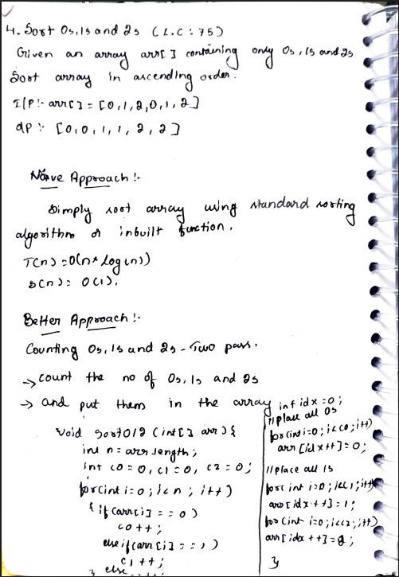
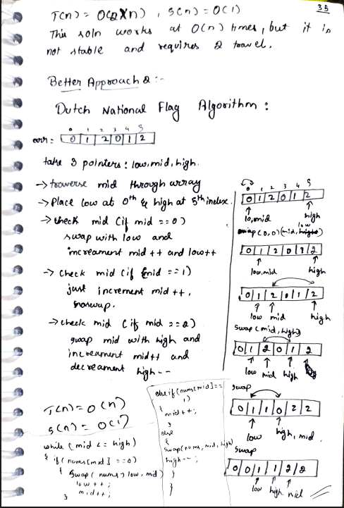

# 4. Sort 0s, 1s and 2s (Sort Colors)

> **Platform:** [LeetCode 75](https://leetcode.com/problems/sort-colors/description/) | [GeeksForGeeks](https://www.geeksforgeeks.org/problems/sort-an-array-of-0s-1s-and-2s4231/1) |  
> **Difficulty:** 🟡 medium  
> **Topic Tags:** `Array` `Two Pointers` `Sorting`  
> **Date Solved:** 7-4-2026

---

## 📝 Problem Statement

> Given an array `arr[]` containing only `0`s, `1`s and `2`s, sort the array in ascending order **in-place**.

**Example:**
```
Input:  arr[] = [0, 1, 2, 0, 1, 2]
Output: [0, 0, 1, 1, 2, 2]
```

---

## 💡 Intuition

> **Naive:** Use inbuilt sort — works but O(n log n) and misses the point.
>
> **Counting (Better):** Count 0s, 1s, 2s — overwrite array in two passes. O(n) time, O(1) space. But not stable and needs 2 traversals.
>
> **Dutch National Flag (Optimal):**  
> Use 3 pointers: `low`, `mid`, `high`.  
> Maintain regions: `[0..low-1]` = 0s, `[low..mid-1]` = 1s, `[high+1..n-1]` = 2s.  
> Process `arr[mid]` each time in a single pass.

---

## 🔄 Approaches

### 🐌 Naive – Inbuilt Sort
**Time:** O(n log n) | **Space:** O(1)

```java
class Solution {
    public void sortColors(int[] nums) {
        Arrays.sort(nums);
    }
}
```

---

### 🧠 Better – Counting (Two Pass)
**Idea:** Count 0s, 1s, 2s → refill array in order.  
**Time:** O(2n) ≈ O(n) | **Space:** O(1)

```java
class Solution {
    public void sortColors(int[] arr) {
        int n = arr.length;
        int c0 = 0, c1 = 0, c2 = 0;

        for (int i = 0; i < n; i++) {
            if (arr[i] == 0) c0++;
            else if (arr[i] == 1) c1++;
            else c2++;
        }

        int idx = 0;
        for (int i = 0; i < c0; i++) arr[idx++] = 0;
        for (int i = 0; i < c1; i++) arr[idx++] = 1;
        for (int i = 0; i < c2; i++) arr[idx++] = 2;
    }
}
```

---

### ⚡ Optimal – Dutch National Flag Algorithm
**Three Pointers:** `low = 0`, `mid = 0`, `high = n-1`

**Rules (while mid ≤ high):**
- `arr[mid] == 0` → `swap(mid, low)`, `low++`, `mid++`
- `arr[mid] == 1` → `mid++` (already in correct region)
- `arr[mid] == 2` → `swap(mid, high)`, `high--` *(don't increment mid — swapped element is unprocessed)*

**Time:** O(n) | **Space:** O(1)

```java
class Solution {
    public void sortColors(int[] nums) {
        int low = 0, mid = 0, high = nums.length - 1;

        while (mid <= high) {
            if (nums[mid] == 0) {
                swap(nums, low, mid);
                low++;
                mid++;
            } else if (nums[mid] == 1) {
                mid++;
            } else {
                swap(nums, mid, high);
                high--;
                // mid NOT incremented
            }
        }
    }

    private void swap(int[] arr, int i, int j) {
        int temp = arr[i]; arr[i] = arr[j]; arr[j] = temp;
    }
}
```

---

## 📊 Complexity Analysis

| Approach | Time | Space |
|----------|------|-------|
| Naive (Inbuilt Sort) | O(n log n) | O(1) |
| Better (Counting) | O(n) | O(1) |
| Optimal (Dutch National Flag) | O(n) | O(1) |

---

## 🗒 Personal Notes

> - 🔥 Best approach = Dutch National Flag Algorithm (DNF)
> - DNF is a classic 3-pointer algorithm — memorize it
> - **Critical:** When `arr[mid] == 2`: swap with `high` but do NOT move `mid` forward (swapped element is unknown)
> - When `arr[mid] == 0`: swap with `low`, increment BOTH `low` and `mid` (element at low was already a 1, so mid zone is safe)
> - Pattern: 3-pointer partitioning

---

## 🖊 Handwritten Notes




---
