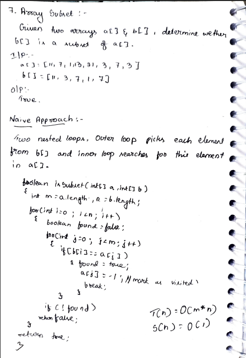
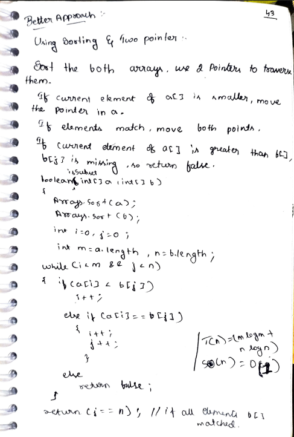
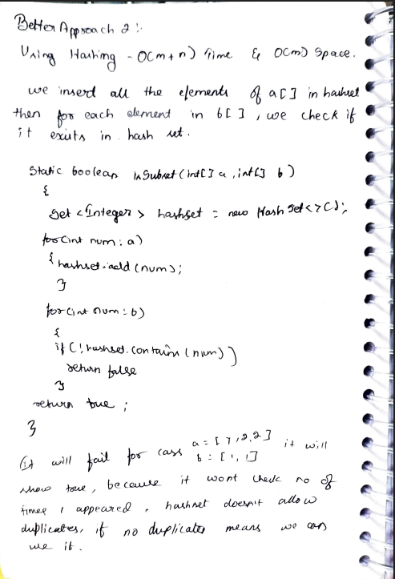

# 7. Array Subset

> **Platform:** [GeeksForGeeks](https://www.geeksforgeeks.org/problems/array-subset-of-another-array2317/1) |  
> **LeetCode:** No direct equivalent |  
> **Difficulty:** 🟢 Easy  
> **Topic Tags:** `Array` `Hashing` `Sorting` `Two Pointers`  
> **Date Solved:** 7-4-2026

---

## 📝 Problem Statement

> Given two arrays `a[]` and `b[]`, determine whether `b[]` is a **subset** of `a[]`.
> Array `b[]` is a subset of `a[]` if every element in `b[]` appears in `a[]` at least as many times.

**Example:**
```
Input:  a[] = [11, 7, 1, 13, 21, 3, 7, 3],  b[] = [11, 3, 7, 1, 7]
Output: true

Input:  a[] = [1, 2, 5],  b[] = [1, 4]
Output: false
```

---

## 💡 Intuition

> **Naive:** For each element in `b[]`, search it in `a[]`. Mark visited to handle duplicates.
>
> **Sorting + Two Pointer:** Sort both, use two pointers to traverse. If `a[i] > b[j]`, `b[j]` is missing.
>
> **HashSet:** Quick O(1) lookup but fails for duplicates (e.g., `b=[2,2]` but `a` has only one `2`).
>
> **HashMap with Frequencies (Best):** Tracks counts correctly — handles duplicates.  
> Decrement count after each match so the same element in `a` can't be used more than it exists.

---

## 🔄 Approaches

### 🐌 Naive – Two Nested Loops
**Idea:** For each `b[i]`, scan `a[]`. Mark found elements as `-1` to prevent reuse.  
**Time:** O(m × n) | **Space:** O(1)

```java
class Solution {
    public boolean isSubset(int[] a, int[] b) {
        int m = a.length, n = b.length;

        for (int i = 0; i < n; i++) {
            boolean found = false;
            for (int j = 0; j < m; j++) {
                if (b[i] == a[j]) {
                    found = true;
                    a[j] = -1; // mark visited
                    break;
                }
            }
            if (!found) return false;
        }

        return true;
    }
}
```

---

### 🧠 Better 1 – Sorting + Two Pointer
**Idea:** Sort both arrays, traverse with two pointers.  
- `a[i] < b[j]` → advance `i`
- `a[i] == b[j]` → match, advance both
- `a[i] > b[j]` → `b[j]` missing → `false`
- Return `j == n` (all of b matched)

**Time:** O(m log m + n log n) | **Space:** O(1)

```java
class Solution {
    public boolean isSubset(int[] a, int[] b) {
        Arrays.sort(a);
        Arrays.sort(b);

        int i = 0, j = 0;
        int m = a.length, n = b.length;

        while (i < m && j < n) {
            if (a[i] < b[j])       i++;
            else if (a[i] == b[j]) { i++; j++; }
            else                   return false;
        }

        return (j == n);
    }
}
```

---

### 🧠 Better 2 – HashSet *(Only if no duplicates in b[])*
**Idea:** Add all `a[]` to HashSet, check if each `b[]` element is in it.  
⚠️ Fails when `b` has duplicates that appear fewer times in `a`.

**Time:** O(m + n) | **Space:** O(m)

```java
class Solution {
    public boolean isSubset(int[] a, int[] b) {
        Set<Integer> set = new HashSet<>();
        for (int num : a) set.add(num);
        for (int num : b) if (!set.contains(num)) return false;
        return true;
    }
}
```

---

### ⚡ Best – HashMap with Frequencies
**Idea:** Count `a[]` frequencies in HashMap. For each `b[]` element, check count > 0 and decrement.

**Time:** O(m + n) | **Space:** O(m)

```java
class Solution {
    public boolean isSubset(int[] a, int[] b) {
        if (b.length > a.length) return false;

        Map<Integer, Integer> freq = new HashMap<>();
        for (int num : a) freq.put(num, freq.getOrDefault(num, 0) + 1);

        for (int num : b) {
            Integer count = freq.get(num);
            if (count == null || count == 0) return false;
            freq.put(num, count - 1);
        }

        return true;
    }
}
```

---

## 📊 Complexity Analysis

| Approach | Time | Space |
|----------|------|-------|
| Naive (Nested Loops) | O(m × n) | O(1) |
| Sorting + Two Pointer | O(m log m + n log n) | O(1) |
| HashSet | O(m + n) | O(m) |
| HashMap (Frequencies) | O(m + n) | O(m) |

---

## 🗒 Personal Notes

> - 🔥 Best approach = HashMap with Frequencies (handles duplicates)
> - **HashSet fails for duplicates** — always use HashMap when duplicates can appear
> - Sorting approach is good when you want O(1) space and duplicates need handling
> - Naive: marking visited elements with `-1` prevents counting one `a[j]` for two different `b[i]`s
> - Pattern: Frequency map for subset/containment checks with duplicates

---

## 🖊 Handwritten Notes





---
