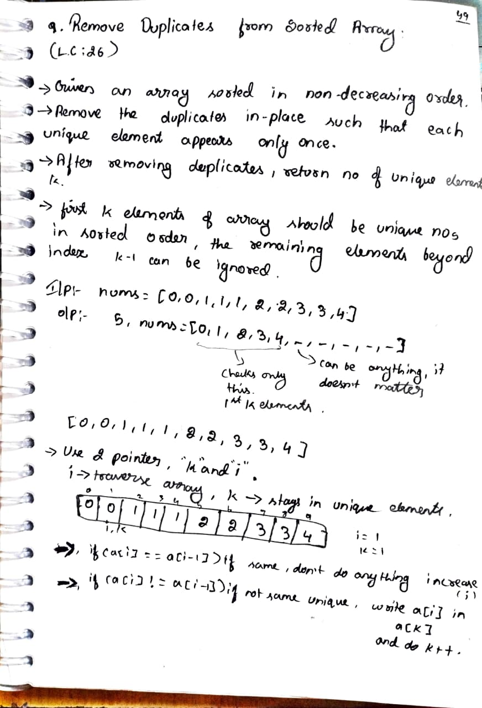
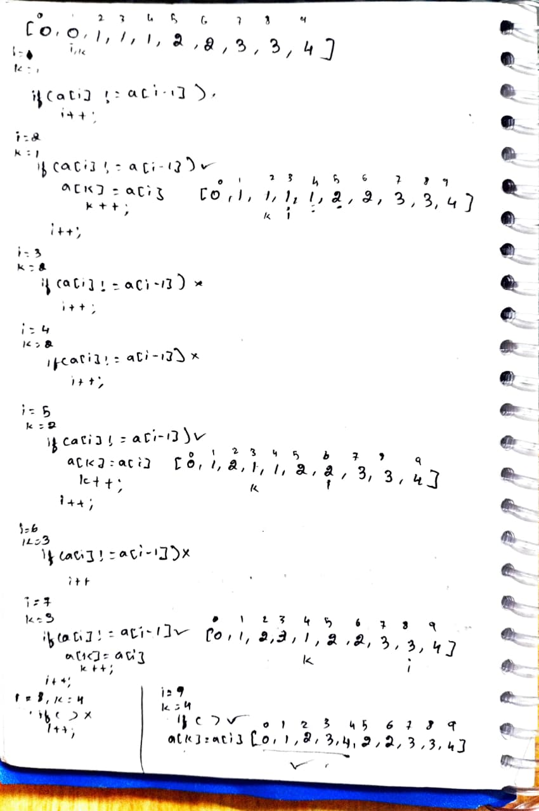
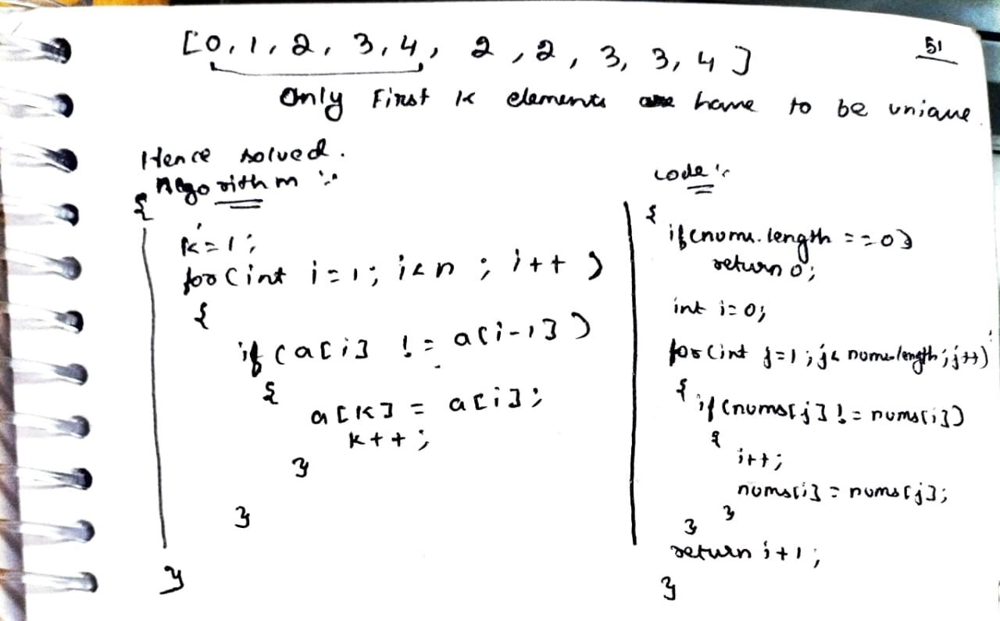

# [Problem Number]. Problem Title

> **Platform:** [LeetCode](https://leetcode.com/problems/remove-duplicates-from-sorted-array/description/)  
> **Difficulty:** 🟢 easy  
> **Topic Tags:** `Array`  
> **Date Solved:** 24-04-2025

---

## 📝 Problem Statement

> Given a sorted array nums (non-decreasing order), remove duplicates in-place such that each unique element appears only once.  
Return the number of unique elements k.

👉 The first k elements must contain unique values in sorted order.  
👉 Elements after index k-1 can be ignored.

**Example:**
```
Input:  [0,0,1,1,1,2,2,3,3,4]  
Output: 5  
nums = [0,1,2,3,4,_,_,_,_,_]

Explanation:
Only first 5 elements are unique and valid.
Remaining values don’t matter.  
```

---

## 💡 Intuition

> Since array is already sorted, duplicates are always adjacent.  
Use two pointers: one to track unique position (i), another to scan (j).  
Whenever a new unique element is found, place it at next position of i.

---

## 🔄 Approaches

### 🐌 Brute Force
**Idea:** Use a HashSet to store unique elements and overwrite array.  
**Time:** O(n) | **Space:** O(n)

```java
// Brute force code here
import java.util.HashSet;

class easy.p08.SortedArray2.easy.p09.RemoveDuplicatesSortedArray.easy.p10.RotateArrayByK.easy.p01.LargestElement.easy.p02.SecondLargestElement.Solution {
    public int removeDuplicates(int[] nums) {
        HashSet<Integer> set = new HashSet<>();
        int index = 0;

        for (int num : nums) {
            if (!set.contains(num)) {
                set.add(num);
                nums[index++] = num;
            }
        }

        return index;
    }
}
```

---

### ⚡ Optimal (Two Pointer)
**Idea:**
  - i → tracks last unique element
  - j → scans array
  - If nums[j] != nums[i], move i and copy value  
**Time:** O(n) | **Space:** O(1)

```java
// Optimal code here
class easy.p08.SortedArray2.easy.p09.RemoveDuplicatesSortedArray.easy.p10.RotateArrayByK.easy.p01.LargestElement.easy.p02.SecondLargestElement.Solution {
    public int removeDuplicates(int[] nums) {
        if (nums.length == 0) return 0;

        int i = 0;

        for (int j = 1; j < nums.length; j++) {
            if (nums[j] != nums[i]) {
                i++;
                nums[i] = nums[j];
            }
        }

        return i + 1;
    }
}
```

---

## 📊 Complexity Analysis

| Approach | Time | Space |
|----------|------|-------|
| Brute | O(n) | O(n) |
| Optimal | O(n) | O(1) |

---

## 🗒 Personal Notes

> - "Key trick: Sorted array → duplicates are adjacent"
> - "Only first k elements matter, rest can be ignored"
> - "Two pointer pattern:"  
>    - i = last unique index  
>     - j = traversal
> - "Very common pattern in interviews"
---

## 🖊 Handwritten Notes

<!-- Add your handwritten notes image here -->
<!--  -->





---
