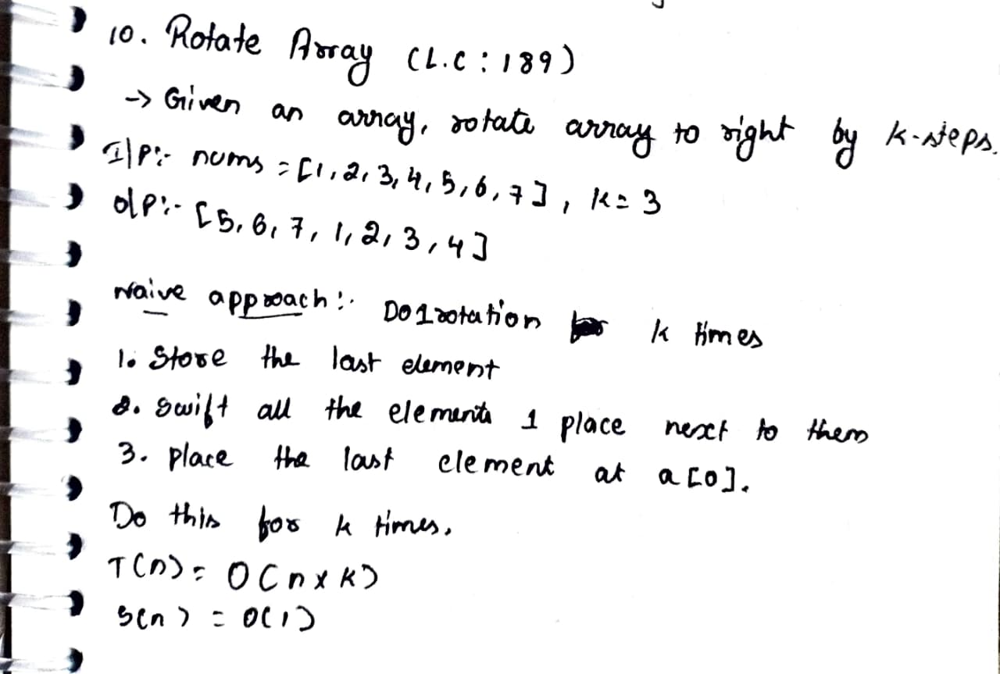
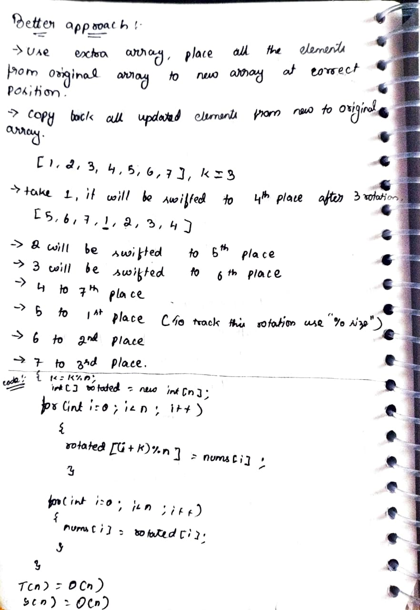
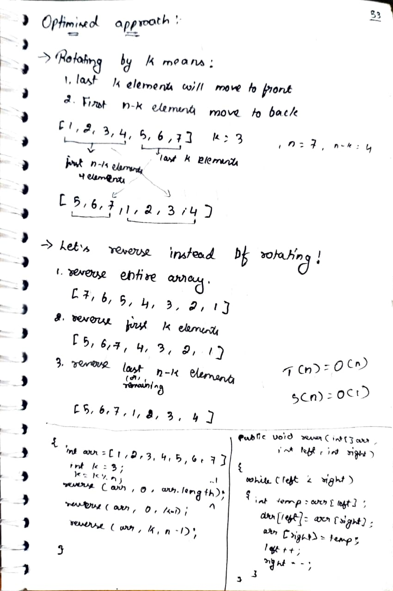

# 10. Rotate Array

> **Platform:** [LeetCode](https://leetcode.com/problems/rotate-array/description/) |  
> **Difficulty:** 🟡 Medium   
> **Topic Tags:** `Array`  
> **Date Solved:** 3-8-2025

---

## 📝 Problem Statement

> Given an integer array nums, rotate the array to the right by k steps, where k is non-negative.

**Example:**
```
Input: nums = [1,2,3,4,5,6,7], k = 3
Output: [5,6,7,1,2,3,4]
Explanation:
rotate 1 steps to the right: [7,1,2,3,4,5,6]
rotate 2 steps to the right: [6,7,1,2,3,4,5]
rotate 3 steps to the right: [5,6,7,1,2,3,4] 
```

---

## 💡 Intuition

> **Rotating by K means :**  
 - Last K elements will move to front
 - First n-K elements will move to back  

   

**Find to way to swap those elements efficiently**


---

## 🔄 Approaches

### 🐌 Brute Force
**Idea:**   
 - Rotate the array one step at a time, k times  
 - Each step:  
   - Store last element
   - Shift all elements right
   - Place last element at index 0  
**Time:** O(n * k) | **Space:** O(1)

```java
// Brute force code here
class easy.p08.SortedArray2.easy.p09.RemoveDuplicatesSortedArray.easy.p10.RotateArrayByK.easy.p01.LargestElement.easy.p02.SecondLargestElement.Solution {
    public void rotate(int[] nums, int k) {
        int n = nums.length;

        for(int i = 0; i < k; i++) {
            int last = nums[n - 1];

            for(int j = n - 1; j > 0; j--) {
                nums[j] = nums[j - 1];
            }

            nums[0] = last;
        }
    }
}
```

---
### 🧠 Better
**Idea:** 
 - Create a new array  
 - Place each element at correct rotated index using:

       newIndex = (i + k) % n 
 - Copy back to original array    
**Time:** O(n) | **Space:** O(n)

```java
// Better code here
class easy.p08.SortedArray2.easy.p09.RemoveDuplicatesSortedArray.easy.p10.RotateArrayByK.easy.p01.LargestElement.easy.p02.SecondLargestElement.Solution {
    public void rotate(int[] nums, int k) {
        int n = nums.length;
        k = k % n;

        int[] rotated = new int[n];

        for(int i = 0; i < n; i++) {
            rotated[(i + k) % n] = nums[i];
        }

        for(int i = 0; i < n; i++) {
            nums[i] = rotated[i];
        }
    }
}
```

---

### ⚡ Optimal
**Idea:** **Reverse Technique**  
Instead of rotating, reverse parts of array  
Steps:   
  1. Reverse entire array  
  2. Reverse first k elements  
  3. Reverse remaining n-k elements    
**Time:** O(n) | **Space:** O(1)

```java
// Optimal code here
class easy.p08.SortedArray2.easy.p09.RemoveDuplicatesSortedArray.easy.p10.RotateArrayByK.easy.p01.LargestElement.easy.p02.SecondLargestElement.Solution {
    public void rotate(int[] nums, int k) {
        int n = nums.length;
        k = k % n;

        reverse(nums, 0, n - 1);
        reverse(nums, 0, k - 1);
        reverse(nums, k, n - 1);
    }

    private void reverse(int[] arr, int left, int right) {
        while(left < right) {
            int temp = arr[left];
            arr[left] = arr[right];
            arr[right] = temp;

            left++;
            right--;
        }
    }
}
```

---

## 📊 Complexity Analysis

| Approach | Time | Space |
|----------|------|-------|
| Brute | O(n * k) | O(1) |
| Better | O(n) | O(n) |
| Optimal | O(n) | O(1) |

---

## 🗒 Personal Notes

> - 🔥 Best approach = Reverse Technique
> - Always do: k = k % n (important edge case)
> - Works in-place → preferred in interviews
> - Pattern: Array manipulation using reverse

---

## 🖊 Handwritten Notes

<!-- Add your handwritten notes image here -->
<!--  -->





---
