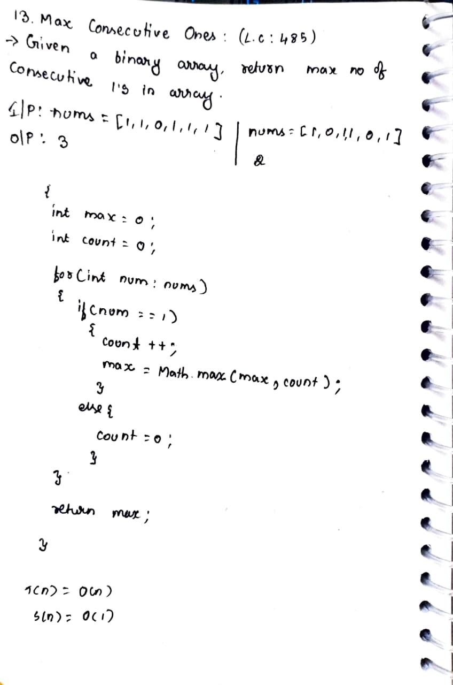

# 13. Max Consecutive Ones

> **Platform:** [LeetCode](https://leetcode.com/problems/max-consecutive-ones/description/) |  
> **Difficulty:** 🟢 Easy  
> **Topic Tags:** `Array`  
> **Date Solved:** 6-4-2026

---

## 📝 Problem Statement

> Given a binary array `nums`, return the maximum number of consecutive `1`'s in the array.

**Example:**
```
Input:  nums = [1, 1, 0, 1, 1, 1]
Output: 3

Input:  nums = [1, 0, 1, 1, 0, 1]
Output: 2
```

---

## 💡 Intuition

> Simple linear scan — maintain a running `count` of consecutive 1s.
> Every time a `1` is seen, increment `count` and update `max`.
> Every time a `0` is seen, reset `count` to 0.
> Return `max` at end.

---

## 🔄 Approaches

### ⚡ Optimal
**Idea:** Single Pass with Counter

**Time:** O(n) | **Space:** O(1)

```java
class Solution {
    public int findMaxConsecutiveOnes(int[] nums) {
        int max = 0;
        int count = 0;

        for (int num : nums) {
            if (num == 1) {
                count++;
                max = Math.max(max, count);
            } else {
                count = 0;
            }
        }

        return max;
    }
}
```

---

## 📊 Complexity Analysis

| Approach | Time | Space |
|----------|------|-------|
| Optimal | O(n) | O(1) |

---

## 🗒 Personal Notes

> - 🔥 One of the simplest array problems
> - Reset `count` on every `0`
> - Update `max` only when `1` is seen (inside if block), not outside
> - Pattern: Running counter with reset

---

## 🖊 Handwritten Notes



---
