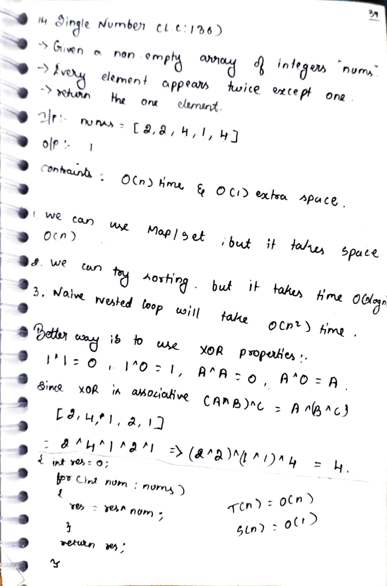

# 14. Single Number

> **Platform:** [LeetCode](https://leetcode.com/problems/single-number/description/) |  
> **Difficulty:** 🟢 Easy  
> **Topic Tags:** `Array` `Bit Manipulation`  
> **Date Solved:** 6-4-2026

---

## 📝 Problem Statement

> Given a non-empty array of integers `nums`, every element appears **twice** except for one.
> Find that single one.
> **Constraint:** Must run in O(n) time and O(1) extra space.

**Example:**
```
Input:  nums = [2, 2, 4, 1, 4]
Output: 1
```

---

## 💡 Intuition

> **Why not simpler approaches?**
> - HashMap/Set → O(n) space ❌
> - Sorting → O(n log n) time ❌
> - Naive nested loop → O(n²) time ❌
>
> **XOR is the key:**
> - `1 ^ 1 = 0` → same elements cancel out
> - `1 ^ 0 = 1` → XOR with 0 gives itself
> - `A ^ A = 0`, `A ^ 0 = A`
> - XOR is associative: `(A^B)^C = A^(B^C)`
>
> So XOR-ing all elements will cancel duplicates and leave the single element.
>
> Example: `[2, 4, 1, 2, 1]`  
> `2^4^1^2^1 = (2^2)^(1^1)^4 = 0^0^4 = 4` ✅

---

## 🔄 Approaches

### 🐌 Brute Force
**Idea:** Nested loop — for each element check if it appears elsewhere  
**Time:** O(n²) | **Space:** O(1)

### 🧠 Better
**Idea:** Use a HashMap to count frequencies, return element with count 1  
**Time:** O(n) | **Space:** O(n)

### ⚡ Optimal: XOR
**Idea:** XOR all elements together — duplicates cancel out, leaving the single element

**Time:** O(n) | **Space:** O(1)

```java
class Solution {
    public int singleNumber(int[] nums) {
        int res = 0;

        for (int num : nums) {
            res = res ^ num;
        }

        return res;
    }
}
```

---

## 📊 Complexity Analysis

| Approach | Time | Space |
|----------|------|-------|
| Brute | O(n²) | O(1) |
| Better (HashMap) | O(n) | O(n) |
| Optimal (XOR) | O(n) | O(1) |

---

## 🗒 Personal Notes

> - 🔥 Best approach = XOR trick
> - XOR properties to remember: `A^A = 0`, `A^0 = A`, associative
> - XOR is order-independent — pairs cancel regardless of position
> - This is a classic Bit Manipulation interview trick
> - Pattern: XOR for finding unique/missing elements

---

## 🖊 Handwritten Notes



---
